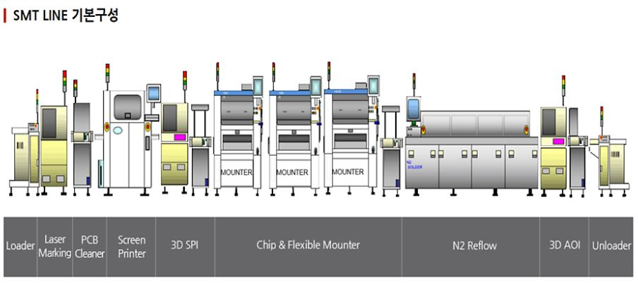

- **PCB 공정**  
    전자부품(소자)을 올리기 전의 빈 기판(베어보드)을 만드는 과정
- **SMT 공정**  
    만들어진 PCB 위에 납을 도포하고, 그 위에 칩, 소자를 올려서 조립품을 만드는 과정

 → **PCB는 "판"을 만들고, SMT는 그 판 위에 "부품"을 얹어 제품으로 만든다!**

### SMT 라인 기본구성

#### 공정 흐름도

**Loader → S/P(Printer) → SPI → Mounter → Reflow → AOI → Unloader**

- **Loader** : PCB 기판을 공급하는 설비
- **S/P(ScreenPrinter)** : PCB 기판에 납을 도포하는 설비
- **SPI** : PCB 기판에 도포된 솔더 크림 도포 상태를 검사하는 설비
- **Mount** : PCB 기판 위에 소자를 실장(Pick and Place)하는 설비
- **Reflow** : 솔더 크림을 열로 녹여서 경화하는 설비
- **AOI** : PCB기판의 양/불 검사하는 설비
- **Unloader** : PCB 기판을 배출하는 설비

