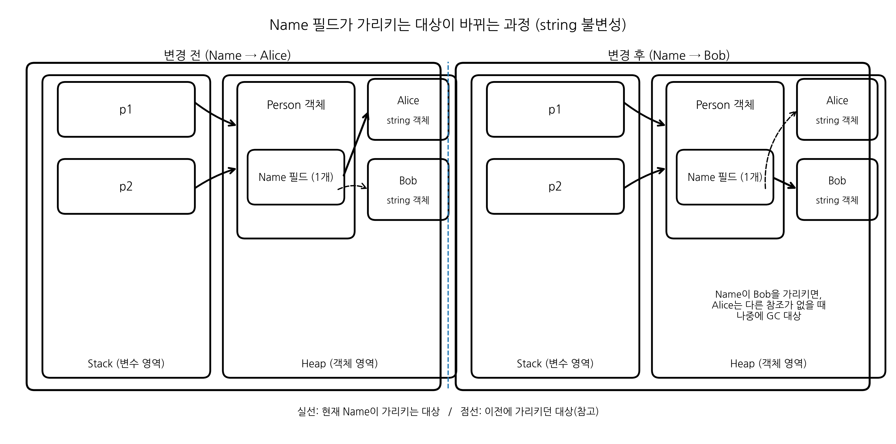

## 값형(Value type)과 참조형(Reference type)
>C#의 타입은 크게 **값 형식(Value type)** 과 **참조 형식(Reference type)** 으로 나뉜다. 
> 둘의 차이는 **변수에 데이터가 직접 들어있는가?(값형), 데이터가 있는 곳의 주소를 들고 있는가?(참조형)** 이다.
### 값 형식(Value type)
- 값 형식은 변수가 **실제 데이터 값을 저장**하는 형식이다.
- 그래서 다른 변수에 대입하면 **값이 복사** 된다.
- 복사된 값은 서로 독립적이라, 한쪽을 바꿔도 다른쪽은 안 바뀐다.
#### 값 형식에 해당하는 자료형들
- `int`, `double`, `bool`, `struct`, `enum`
> **C#에서 struct로 만든 타입은 무조건 값 형식**이다.
>자세한 내용은 [[구조체]]를 확인

---
값 형식을 함수의 인자로 전달할 때 내부에서 변수값을 변경해도 원본의 변수값은 변하지 않는다.
**값 형식 예제 코드**
```csharp
using System;
using System.Text;
using static System.Runtime.InteropServices.JavaScript.JSType;

namespace ConsoleApp
{
    internal class Program
    {
        public static void TestValue(int a)
        {
            a += 10; //a는 30이 됨 하지만 복사본, 함수가 끝나고 나면 a는 사라짐
        }

        static void Main(string[] args)
        {
            int value = 20;

            Console.WriteLine(value);
            TestValue(value); //value의 값 20이 복사돼서 매개변수 a로 들어감
            Console.WriteLine(value);
        }
    }
}
```
### 참조 형식(Reference type)
- 참조 형식은 데이터가 있는 곳을 가리키는 **참조값을 저장**한다.
- 다른 변수에 대입하면 **참조값이 복사** 된다. 그래서 두 변수가 **같은 객체를 가리킬 수 있다.**
- 참조 형식을 함수의 인자로 전달할 때 내**부에서 변수값을 변경하면 원본의 변수값도 변한다.**
#### 참조 형식에 해당하는 자료형들
- `class`, `string`, `array`, `List`, `Dictionary`
- `string` (**참조형식(reference type)** 이면서 동시에 **불변(immutable)**) [[study/csharp/02 기본형, 형변환, 조건문 ,연산자#string의 불변성 + 참조 재할당|string 불변성 파트]]

> **C#에서 class로 만든 타입은 무조건 참조 형식**이다.

---
##### 참조 형식 예제 코드
```csharp
using System;

class Person
{
    public string Name;
}

class Program
{
    static void Main()
    {
        Person p1 = new Person();
        p1.Name = "Alice";

        Person p2 = p1;   // 참조 복사 → 같은 객체를 가리킴

        p2.Name = "Bob";  // p2에서 Bob으로 값 변경

        Console.WriteLine(p1.Name); // Bob
        Console.WriteLine(p2.Name); // Bob
    }
}
```

**배열 예제 코드**
- 배열도 참조형이라서 같이 바뀐다.
```csharp
using System;

class Program
{
    static void Main()
    {
        int[] arr1 = { 1, 2, 3 };
        int[] arr2 = arr1;    // 참조 복사 → 같은 객체를 가리킴

        arr2[0] = 999;

        Console.WriteLine(arr1[0]); // 999
        Console.WriteLine(arr2[0]); // 999
    }
}
```
