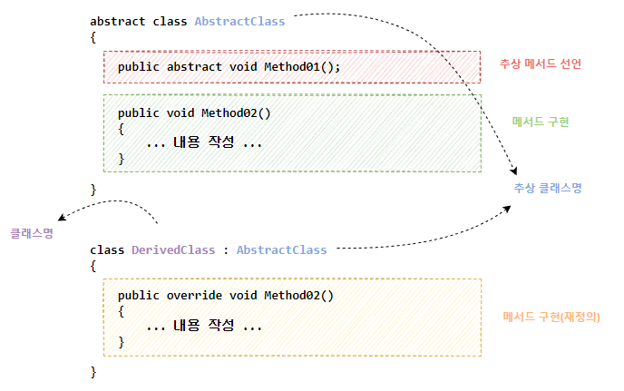

### 인터페이스 (Interface)
- 인터페이스는 클래스가 따라야 할 **명세(contract)** 를 정의한다.
- 구현을 포함하지 않으며, 오직 시그니처만을 포함한다. 이를 통해 클래스가 특정 기능을 반드시 제공하도록 강제할 수 있다.
- 클래스는 **여러 개의 인터페이스를 동시에 구현(다중 구현)** 할 수 있다.
- `class Dog : IAnimal` 처럼 `IAnimal`을 구현하는 순간, `IAnimal`에 정의된 동작을 **모두 구현해야 하며**, 구현하지 않으면 **컴파일 에러**가 발생한다.

```csharp
// IAnimal 인터페이스 정의
public interface IAnimal
{
	void MakeSound();
}

// Dog 클래스, IAnimal 인터페이스 구현
public class Dog : IAnimal
{
	public void MakeSound()
	{
		Console.WriteLine("멍멍");
	}
}

// Cat 클래스, IAnimal 인터페이스 구현
public class Cat : IAnimal
{
	public void MakeSound()
	{
		Console.WriteLine("야옹");
	}

}

// 사용 예시
class Program
{
	static void Main(string[] args)
	{
		IAnimal animal1 = new Dog();
		IAnimal animal2 = new Cat();

		animal1.MakeSound(); // "멍멍" 출력
		animal2.MakeSound(); // "야옹" 출력
	}
}
```

### 추상클래스 (Abstract Class)
 - 추상 클래스는 **공통 기능과 틀을 제공**하는 데 사용된다.
 - **공통 기능은 미리 구현**해 둘 수 있고(일반 메서드), **필수로 채워야 하는 부분은 추상 메서드로 강제**할 수 있다.


```csharp
abstract class AbstractClass //추상 클래스
{
	public abstract void Method01(); //추상 메서드
	public void Method02() //일반 메서드 (공통 기능)
	{
		Console.WriteLine("[Method02] 추상클래스에서 구현 가능");
	}
}

class DerivedClass : AbstractClass
{
	public override void Method01()
	{
		Console.WriteLine("[Method01] 파생클래스에서 구현(재정의)");
	}
}

class Program
{
	static void Main(string[] args)
	{
		AbstractClass Test = new DerivedClass();
		//AbstractClass Test = new AbstractClass(); 추상 클래스는 new 로 생성 불가
		Test.Method01();
		Test.Method02();
	}
}
```