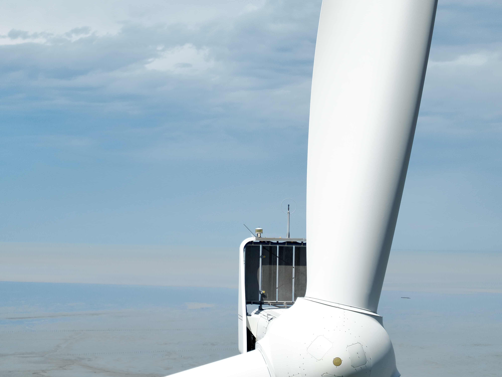
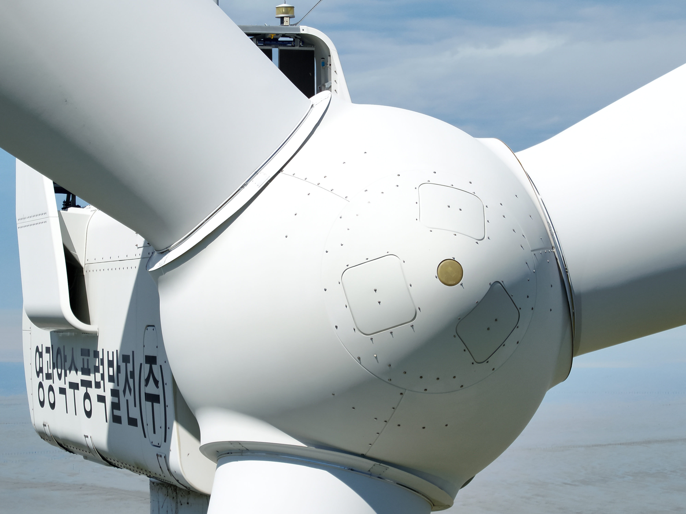
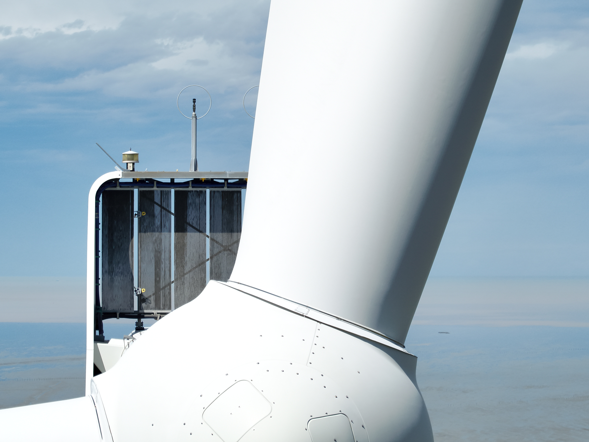
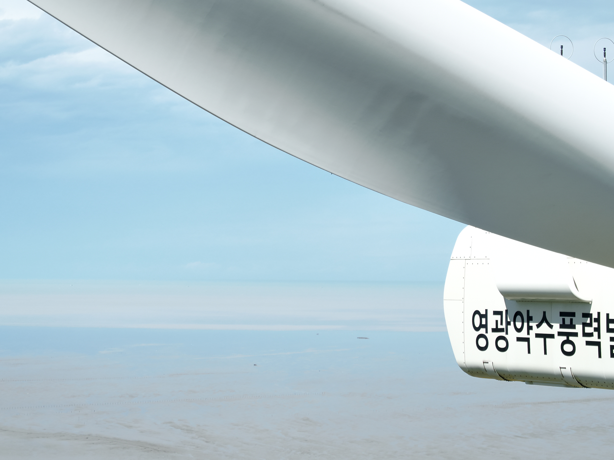
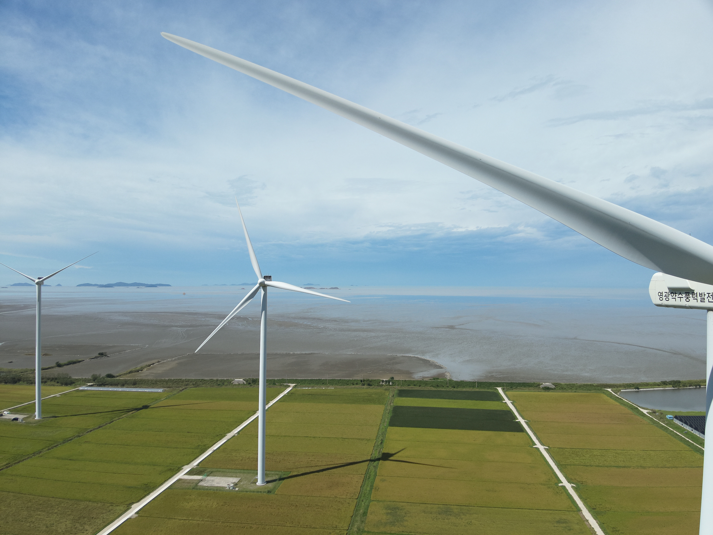

### 🔗Link

https://github.com/hyunah96/DAIR_APP
### 프로젝트 배경
풍력발전기 블레이드 점검은 발전기를 일시 정지시킨 뒤 작업자가 직접 접근하여 <br>육안으로 확인하는 방식이 여전히 많이 사용됩니다.  
이 과정은 안전 리스크가 크고, 점검 시간만큼 발전 손실(매출 손실)이 발생합니다.<br><br>
**기존 방식으로 작업자가 직접 블레이드를 점검하는 현장 모습**
<p>
  
  
</p>
이러한 배경에서 본 프로젝트는 사람 대신 드론으로 점검을 수행하여 블레이드를 근접 촬영하고,<br>촬영 데이터를 서버로 전송해 축적한 뒤, 향후 AI 기반 손상/정상 분석(학습,추론)으로 이어지는 <br>유지관리 자동화를 목표로 시작되었습니다.<br>

### LRF 기반, 풍력발전기 블레이드 실시간 모니터링 시스템

**1. 드론 및 카메라 연결, 상태 확인**  
DJI SDK 등록, 초기화를 완료한 뒤 제품 연결 상태를 감지합니다.  
네트워크 상태 및 카메라 저장소 상태(SD카드)를 확인해 촬영 가능 여부를 판단합니다.

**2. 저장소(SD카드) 상태 감지 및 촬영 준비**  
카메라 저장소 정보를 구독하여 SD카드 삽입 여부, 남은 용량, 촬영 가능 개수 등을 실시간으로 갱신합니다.  
SD카드가 삽입되면 촬영 및 파일 처리(서버 전송) 흐름을 활성화하고, 제거 시 관련 동작을 비활성화합니다.

**3. LRF 거리값 수신 및 유효값 필터링(촬영 조건 판단)**  
LRF 거리값을 실시간으로 수신합니다.  
3m 이하 근거리 값과 급격한 거리 변화를 제외하고, 유효 거리 5~6m 구간에서 촬영을 트리거합니다.

**4. 촬영 완료 이벤트 감지**  
촬영 요청 후 상태 리스너를 등록하여 촬영 결과를 감지합니다.  
촬영 완료 이벤트가 확인되면 다음 단계에서 최신 촬영 파일을 조회합니다.

**5. 최신 미디어 파일 조회**
사진 필터(`MediaFileFilter.PHOTO`)를 적용하여 카메라 저장소의 미디어 리스트를 pull 합니다.  
목록 갱신 상태를 기반으로 최신 촬영 파일을 식별하고, 다운로드 대상 파일을 확정합니다.

**6. 촬영 파일 다운로드**
선택된 최신 파일을 드론 조종기 로컬 저장소 `Pictures`에 다운로드합니다.  

**7. FTP 서버로 이미지 업로드 및 전송 확인**  
FTP 서버에 접속/로그인 후 로컬에 저장된 촬영 파일을 업로드하여 데이터 축적을 자동화합니다. <br>FileZilla를 통해 업로드 결과(파일 생성/전송 상태)를 확인합니다.
### 사용 기술 및 개발 환경
- 개발언어 : Kotlin, Java
- SDK : DJI Mobile SDK (MSDK V5 aircraft: 5.8.0), DJI UX SDK
- 플랫폼 : Android (Android 10 / API 29)
- Android SDK 설정 : minSdkVersion 23, targetSdkVersion 34
- 통신/전송 : FTP
- IDE : Android Studio
- 형상관리 : GIT, GITLAB
### STEP1. 상세 페이지


#### SD 카드 삽입 여부에 따른 촬영 모드 활성화/비활성화


#### FTP(FileZilla)


### STEP2. APP 개발
**SD카드 장착 여부에 따른 촬영 활성화/비활성화**
```java
private void updateCameraForegroundResource(@NonNull CameraPhotoState cameraPhotoState,
                                           @NonNull CameraPhotoStorageState cameraPhotoStorageState) {
    Drawable foregroundDrawable = updateCameraActionSound(cameraPhotoState);

    if (cameraPhotoStorageState instanceof CameraSDPhotoStorageState) {
        CameraSDPhotoStorageState sdStorageState = (CameraSDPhotoStorageState) cameraPhotoStorageState;
        if (cameraPhotoStorageState.getStorageLocation() == CameraStorageLocation.SDCARD) {
            foregroundDrawable = updateResourceWithStorageInSDCard(sdStorageState);
        } else if (cameraPhotoStorageState.getStorageLocation() == CameraStorageLocation.INTERNAL) {
            Log.d("TAG","CameraStorageLocation.INTERNAL");
            foregroundDrawable = updateResourceWithStorageInternal(sdStorageState);
        }
    }
    storageStatusOverlayImageView.setImageDrawable(foregroundDrawable);
}
```
**LRF 거리값 수신 → 유효값 필터링 → 촬영 트리거**
```java
try {
KeyManager.getInstance().setValue(
	KeyTools.createKey(CameraKey.KeyLaserWorkMode),
	LaserWorkMode.OPEN_ALWAYS,
	new CommonCallbacks.CompletionCallback() {
@Override
public void onSuccess() {
KeyManager.getInstance().listen(
KeyTools.createKey(CameraKey.KeyLaserMeasureInformation),
	this,
	(oldValue, newValue) -> {
		newValue = KeyManager.getInstance().getValue(
KeyTools.createKey(CameraKey.KeyLaserMeasureInformation)
		);
		if (newValue != null) {
			final double min_distance = 3.0;
			double currentDistance =newValue.getDistance();
			double test = Math.abs(currentDistance -previousDistance);
			if (previousDistance == -1) {
				previousDistance = currentDistance;
			}
			if (currentDistance < min_distance
					|| Math.abs(currentDistance - previousDistance) >= 10) {
			} else {
				if (currentDistance >= 5.0 && currentDistance <= 6.0) {
					actionOnShootingPhoto();
				}
			}
			laserDistance.setText(String.format("%.2f m", currentDistance));
```
**FTPConnectionManager**
```java
public class FTPConnectionManager {
    private FTPClient ftpClient;
    private static String server = "121.179.183.64";
    private static int port = 300;
    private static String user = "hakim";
    private static String password = "";
    private boolean ftp_connected = false;
    private boolean onUpdate = false;
    private FileOutputStream fos;
    private FileInputStream fis;
    private ExecutorService executorService;
    private Channel channel = null;
    private ChannelSftp channelSftp = null;
    
    public FTPConnectionManager() {
        EventBus.getDefault().register(this);
        this.executorService = Executors.newSingleThreadExecutor();
    }
```
<details>
<summary><b>getSFTPConnection() — SD카드 삽입 시 로그인</b></summary>

```java
//SD카드 삽입되면 이벤트 발생 감지하여 FTP 로그인
    public static Session getSFTPConnection() throws JSchException {
        JSch jSch = new JSch();
        Session session = null;
            try {
                Log.d("TAG","session");
                session = jSch.getSession(user, server, port);
                session.setPassword(password);
                Properties config = new Properties();
                config.put("StricHostKeyChecking", "no");
                session.setConfig(config);
                session.connect();
                Log.d("TAG","session.connect();");
            } catch (Exception e){
                e.printStackTrace();
            }
        return session;
    }
```
</details>
<details>
<summary><b>shootPhotoEvent() — 촬영 이벤트 감지</b></summary>

```java
//촬영 이벤트 감지 메서드
@Subscribe(threadMode = ThreadMode.MAIN)
public void shootPhotoEvent(ShootPhotoEvent shootPhotoEvent) {
    IMediaManager mediaManager = MediaDataCenter.getInstance().getMediaManager();
    //파일 목록 변경 감지
    mediaManager.addMediaFileListStateListener(new MediaFileListStateListener() {
        @Override
        public void onUpdate(MediaFileListState mediaFileListState) {
            Log.d("TAG", "onUpdate ");

            Log.d("TAG", "MediaFileListState.UP_TO_DATE ");
            pollForMediaFiles(mediaManager);
        }
    });
    MediaFileFilter mediaFileFilter = MediaFileFilter.PHOTO;
    PullMediaFileListParam param = new PullMediaFileListParam.Builder().filter(mediaFileFilter).build();
    //파일 목록 가져오기
    mediaManager.pullMediaFileListFromCamera(param, new CommonCallbacks.CompletionCallback() {
        @Override
        public void onSuccess() {
            Log.d("TAG", "onSuccess");
            onUpdate = true;
            pollForMediaFiles(mediaManager);
        }
        @Override
        public void onFailure(@NonNull IDJIError idjiError) {
            Log.d("TAG", "onFailure" + idjiError);
        }
    });
}
```
</details>
<details>
<summary><b>pollForMediaFiles() — 최신 파일 조회</b></summary>

```java
private void pollForMediaFiles(IMediaManager mediaManager){
    Log.d("test","pollForMediaFiles");
    MediaFileListData mediaFileListData = mediaManager.getMediaFileListData();
    List<<MediaFile>> files = mediaFileListData.getData();
    if(onUpdate) {
        if (!files.isEmpty()) {
            Log.d("TAG", "파일 갯수 " + files.size());
            MediaFile mediaFile = files.get(0);
            handleFiles(mediaFile);
        } else {
            Log.d("TAG", "files is empty");
            new Handler().postDelayed(() -> pollForMediaFiles(mediaManager), 1000);
        }
    }
}
```
</details>
<details>
<summary><b>handleFiles() — 촬영 파일 다운로드</b></summary>

```java
//외부저장소로 업데이트
private void handleFiles(MediaFile latestFile){
    Log.d("TAG","handleFiles");
    var savePath = Environment.getExternalStoragePublicDirectory(Environment.DIRECTORY_PICTURES);
    File localfile = new File(savePath,latestFile.getFileName());
    try {
        fos = new FileOutputStream(localfile,true);
    } catch (Exception e){
        Log.d("TAG","file Exception : "+ e);
    }
    latestFile.pullOriginalMediaFileFromCamera(0, new MediaFileDownloadListener() {
        @Override
        public void onStart() {
            Log.d(" TAG","onStart");
        }
        @Override
        public void onProgress(long total, long current) {
            double num = (double) current/total * 100;
            Log.d("TAG","파일명 : " + latestFile.getFileName() + " 다운로드 : " + num);
        }
        @Override
        public void onRealtimeDataUpdate(byte[] data, long position) {
            try {
                fos.write(data);
                fos.flush();
            } catch (IOException e) {
                Log.d("TAG","onRealtimeDataUpdate error : "+ e);
            }
        }
        @Override
        public void onFinish() {
            Log.d("test","onFinish");
            if(localfile.exists()) {
                Log.d("TAG","onFinish localfile.exists()");
                uploadFileToFTP(localfile,latestFile.getFileName());
            }
        }
        @Override
        public void onFailure(IDJIError error) {
        }
    });
}
```
</details>
<details>
<summary><b>uploadFileToFTP() — FTP 업로드</b></summary>

```java
public void uploadFileToFTP(File localfile, String fileName) {
    executorService.execute(() -> {
        try {
            ftpClient.setFileType(FTP.BINARY_FILE_TYPE);
            ftpClient.enterLocalPassiveMode();
            //String serverFilePath = "/srv/ftp/" + fileName;
            String serverFilePath = "/home/hakim" + fileName;
            try {
                fis = new FileInputStream(localfile);
                boolean result = ftpClient.storeFile(serverFilePath,fis);
                Log.d("test","result : "+ result);
                if (!result) {
                    Log.d("test", "FTP Upload Failed. Reply Code: " + ftpClient.getReplyCode() + " Reply String: " + ftpClient.getReplyString());
                }
            }
            catch(FileNotFoundException e){
                Log.d("test","FileNotFoundException");
            }
        }
        catch (Exception e){
            Log.d("test","uploadFileToFTP catch :"+e);
        }
    });
}
```
</details>
### STEP3. 테스트 결과
#### 3-1) 현장 테스트 요약
- **장소/날짜:** 백수읍 풍력단지 (전남 영광)
- **테스트 내용:**
	**1차**
    - LRF기반 거리 측정을 통해 풍력발전기와의 안전 거리 현장 검증
    - LRF 감지 조건에서 짐벌 카메라의 초당 촬영 가능 횟수를 검증
	**2차**
    - 짐벌 카메라의 줌(Zoom) 기능을 활용해 블레이드 감지 이후 자동 연속 촬영 기능의 적용 가능성을 검증
- **테스트 시나리오:**
    - LRF 거리값 수신 → 유효값 필터링 → 촬영 트리거 동작 확인
    - 줌(최대 줌) 상태에서 블레이드 감지 시 자동 연속 촬영 관찰
- **결과 요약:**
    - 1차 테스트에서 자동 촬영 트리거의 기본 동작과 안정성을 확인했고, 촬영 알고리즘 개선을 위한 데이터를 확보함
		      <p>
		  
		  
		</p>
    - 2차 테스트에서는 허브(Hub) 근처 영역은 비교적 안정적으로 촬영되었으나, 블레이드 팁(Blade Tip) 영역은 정확도가 낮아지는 경향을 확인함
      <details>
<summary><b>2차 테스트 촬영 결과(사진) 펼치기</b></summary>









</details>

#### 3-2) 성능 한계 분석
- **팁(Blade Tip) 구간 촬영 정확도 저하**
    - **관찰:** 블레이드 회전 속도는 바람 조건에 따라 변동하며 저속 회전에서는 촬영 정확도가 비교적 안정적이었음. 반면 고속 회전에서는 팁영역에서 블러, 프레임 이탈이 증가하는 경향을 확인함.
    - **원인:** 팁은 회전 반경이 가장 크기 때문에 이동 속도가 가장 빠른 구간이므로, 셔터 타이밍이 조금만 어긋나도 피사체가 프레임을 벗어나거나 흐리게 촬영됨.
    - **장비 제약:** 사용한 짐벌 DJI Zenmuse H20은 고화질 정밀 촬영에 최적화되어 있지만 고속 회전 물체를 연속 촬영하는 시나리오에서는 촬영 속도 측면의 한계를 확인함.
- **초점 이탈(포커스 풀림)로 인한 흐림 현상**
    - **관찰:** 블레이드의 회전 속도와 무관하게, 일부 촬영 결과에서 초점이 맞지 않아 전체 프레임이 흐릿하게 기록되는 사례가 발생함.
    - **예상 원인:**
        - 줌(Zoom) 사용 시 초점 민감도 증가
        - 바람에 의한 기체의 흔들림으로 인한 초점 이탈
    - **개선 방향:**
        - 짐벌 카메라의 초점 상태(짐벌 카메라 상태값)를 로그를 통해 실시간으로 확인하여, 줌 배율 구간별 초점 안정성을 비교하고 최적의 배율을 도출해야함

#### 3-3) 개선 계획
- DJI M30 대신 자체 제작 드론을 사용하고, 고속 연사가 가능한 짐벌 카메라와 온보드 컴퓨터를 탑재하는 방향으로 구성을 변경할 예정
- 데이터는 이더넷(Ethernet) 유선 통신으로 연결하여 무선 대비 지연을 줄이고 데이터 전송을 더 안정적으로 만들 계획
- 촬영 데이터를 충분히 모은 뒤, 이를 기반으로 AI 손상/정상 분석(학습,추론) 단계로 확장할 예정


