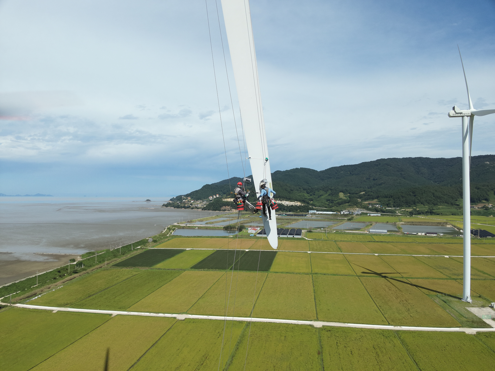
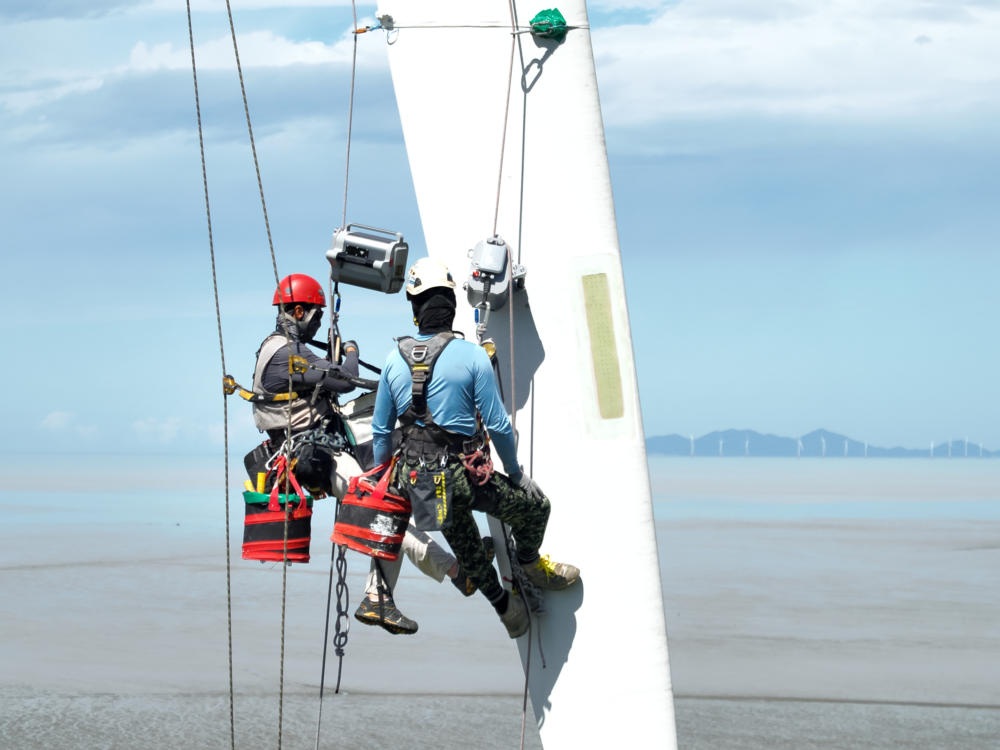
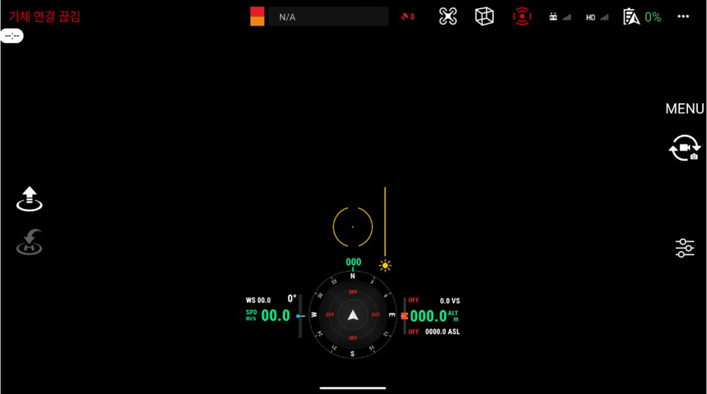
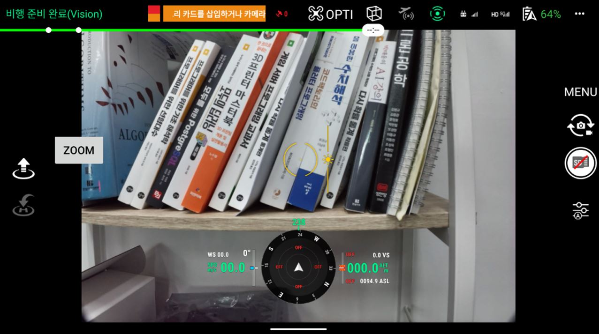
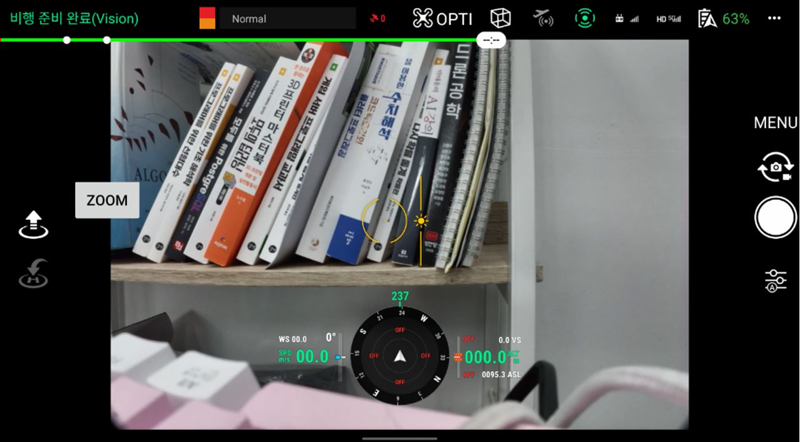
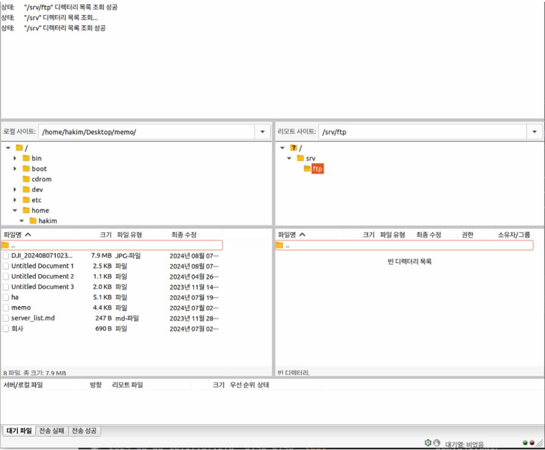
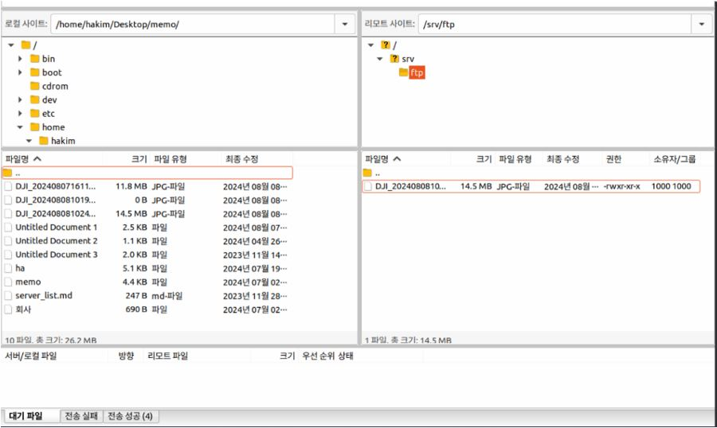

### 🔗Link

https://github.com/hyunah96/DAIR_APP
### 프로젝트 배경
풍력발전기 블레이드 점검은 발전기를 일시 정지시킨 뒤 작업자가 직접 접근하여 <br>육안으로 확인하는 방식이 여전히 많이 사용됩니다.  
이 과정은 안전 리스크가 크고, 점검 시간만큼 발전 손실(매출 손실)이 발생합니다.<br><br>
기존 방식으로 작업자가 직접 블레이드를 점검하는 현장 모습
<p>
  
  
</p>
이러한 배경에서 본 프로젝트는 사람 대신 드론으로 점검을 수행하여 블레이드를 근접 촬영하고,<br>촬영 데이터를 서버로 전송해 축적한 뒤, 향후 AI 기반 손상/정상 분석(학습,추론)으로 이어지는 유지관리 자동화를 목표로 시작되었습니다.<br>

### LRF 기반, 풍력발전기 블레이드 실시간 모니터링 시스템

**1. 드론 및 카메라 연결, 상태 확인**  
DJI SDK 등록, 초기화를 완료한 뒤 제품 연결 상태`(Product Connect/Disconnect)`를 감지합니다.  
네트워크 상태 및 카메라 저장소 상태(SD카드)를 확인해 촬영 가능 여부를 판단합니다.

**2. 저장소(SD카드) 상태 감지 및 촬영 준비**  
카메라 저장소 정보를 구독하여 SD카드 삽입 여부, 남은 용량, 촬영 가능 개수 등을 실시간으로 갱신합니다.  
SD카드가 삽입되면 촬영 및 파일 처리(서버 전송) 흐름을 활성화하고, 제거 시 관련 동작을 비활성화합니다.

**3. LRF 거리값 수신 및 유효값 필터링(촬영 조건 판단)**  
`LaserWorkMode`를 `OPEN_ALWAYS`로 설정한 뒤 LRF 거리값을 실시간으로 수신합니다.  
3m 이하 근거리 값과 급격한 거리 변화를 제외하고, 유효 거리 5~6m 구간에서 촬영을 트리거합니다.

**4. 촬영 완료 이벤트 감지**  
촬영 요청 후 `MediaManager` 상태 리스너를 등록하여 촬영 결과를 감지합니다.  
촬영 완료 이벤트가 확인되면 다음 단계에서 최신 촬영 파일을 조회합니다.

**5. 최신 미디어 파일 조회**
사진 필터(`MediaFileFilter.PHOTO`)를 적용해 카메라 저장소의 미디어 리스트를 pull 합니다.  
목록 갱신 상태를 기반으로 최신 촬영 파일을 식별하고, 다운로드 대상 파일을 확정합니다.

**6. 촬영 파일 다운로드**
선택된 최신 파일을 `pullOriginalMediaFileFromCamera()`로 드론 조종기 로컬 저장소(Pictures)에 다운로드합니다.  

**7. FTP 서버로 이미지 업로드 및 전송 확인**  
FTP 서버에 접속/로그인 후 로컬에 저장된 촬영 파일을 업로드하여 데이터 축적을 자동화합니다. FileZilla를 통해 업로드 결과(파일 생성/전송 상태)를 확인합니다.
### 사용 기술 및 개발 환경
- 개발언어 : Kotlin, Java
- SDK : DJI Mobile SDK (MSDK V5 aircraft: 5.8.0), DJI UX SDK
- 플랫폼 : Android (Android 10 / API 29)
- Android SDK 설정 : minSdkVersion 23, targetSdkVersion 34
- 통신/전송 : FTP
- IDE : Android Studio
- 형상관리 : GIT, GITLAB
### STEP1. 상세 페이지


#### SD 카드 삽입 여부에 따른 촬영 모드 활성화/비활성화


#### FTP(FileZilla)


### STEP2. APP 개발
**SD카드 장착 여부에 따른 촬영 활성화/비활성화**
```java
private void updateCameraForegroundResource(@NonNull CameraPhotoState cameraPhotoState,
                                           @NonNull CameraPhotoStorageState cameraPhotoStorageState) {
    Drawable foregroundDrawable = updateCameraActionSound(cameraPhotoState);

    if (cameraPhotoStorageState instanceof CameraSDPhotoStorageState) {
        CameraSDPhotoStorageState sdStorageState = (CameraSDPhotoStorageState) cameraPhotoStorageState;
        if (cameraPhotoStorageState.getStorageLocation() == CameraStorageLocation.SDCARD) {
            foregroundDrawable = updateResourceWithStorageInSDCard(sdStorageState);
        } else if (cameraPhotoStorageState.getStorageLocation() == CameraStorageLocation.INTERNAL) {
            Log.d("TAG","CameraStorageLocation.INTERNAL");
            foregroundDrawable = updateResourceWithStorageInternal(sdStorageState);
        }
    }
    storageStatusOverlayImageView.setImageDrawable(foregroundDrawable);
}
```
**LRF 거리값 수신 → 유효값 필터링 → 촬영 트리거**
```java
try {
    KeyManager.getInstance().setValue(
            KeyTools.createKey(CameraKey.KeyLaserWorkMode),
            LaserWorkMode.OPEN_ALWAYS,
            new CommonCallbacks.CompletionCallback() {
                @Override
                public void onSuccess() {
                    KeyManager.getInstance().listen(
                        KeyTools.createKey(CameraKey.KeyLaserMeasureInformation),
                            this,
                            (oldValue, newValue) -> {
                                newValue = KeyManager.getInstance().getValue(
                        KeyTools.createKey(CameraKey.KeyLaserMeasureInformation)
                                );
                                if (newValue != null) {
                                    final double min_distance = 3.0;
                                    double currentDistance =newValue.getDistance();
                                    double test = Math.abs(currentDistance -previousDistance);
                                    if (previousDistance == -1) {
                                        previousDistance = currentDistance;
                                    }
                                    if (currentDistance < min_distance
                                            || Math.abs(currentDistance - previousDistance) >= 10) {
                                    } else {
                                        if (currentDistance >= 5.0 && currentDistance <= 6.0) {
                                            actionOnShootingPhoto();
                                        }
                                    }
                                    laserDistance.setText(String.format("%.2f m", currentDistance));
```
**FTPConnectionManager**
```java
public class FTPConnectionManager {
    private FTPClient ftpClient;
    private static String server = "121.179.183.64";
    private static int port = 300;
    private static String user = "hakim";
    private static String password = "";
    private boolean ftp_connected = false;
    private boolean onUpdate = false;
    private FileOutputStream fos;
    private FileInputStream fis;
    private ExecutorService executorService;
    private Channel channel = null;
    private ChannelSftp channelSftp = null;
    
    public FTPConnectionManager() {
        EventBus.getDefault().register(this);
        this.executorService = Executors.newSingleThreadExecutor();
    }
```
<details>
<summary><b>getSFTPConnection() (SD카드 삽입 시 로그인)</b></summary>

```java
//SD카드 삽입되면 이벤트 발생 감지하여 FTP 로그인
    public static Session getSFTPConnection() throws JSchException {
        JSch jSch = new JSch();
        Session session = null;
            try {
                Log.d("TAG","session");
                session = jSch.getSession(user, server, port);
                session.setPassword(password);
                Properties config = new Properties();
                config.put("StricHostKeyChecking", "no");
                session.setConfig(config);
                session.connect();
                Log.d("TAG","session.connect();");
            } catch (Exception e){
                e.printStackTrace();
            }
        return session;
    }
</details>
<details>
<summary><b>shootPhotoEvent() (촬영 이벤트 감지)</b></summary>
```java
    `//촬영 이벤트 감지 메서드     @Subscribe(threadMode = ThreadMode.MAIN)     public void shootPhotoEvent(ShootPhotoEvent shootPhotoEvent) {         IMediaManager mediaManager = MediaDataCenter.getInstance().getMediaManager();         //파일 목록 변경 감지         mediaManager.addMediaFileListStateListener(new MediaFileListStateListener() {             @Override             public void onUpdate(MediaFileListState mediaFileListState) {                 Log.d("test", "onUpdate ");                  Log.d("test", "MediaFileListState.UP_TO_DATE ");                 pollForMediaFiles(mediaManager);             }         });         MediaFileFilter mediaFileFilter = MediaFileFilter.PHOTO;         PullMediaFileListParam param = new PullMediaFileListParam.Builder().filter(mediaFileFilter).build();         //파일 목록 가져오기         mediaManager.pullMediaFileListFromCamera(param, new CommonCallbacks.CompletionCallback() {             @Override             public void onSuccess() {                 Log.d("test", "onSuccess");                 onUpdate = true;                 pollForMediaFiles(mediaManager);             }             @Override             public void onFailure(@NonNull IDJIError idjiError) {                 Log.d("test", "onFailure" + idjiError);             }         });     }`

</details>

영광 테스트베드


