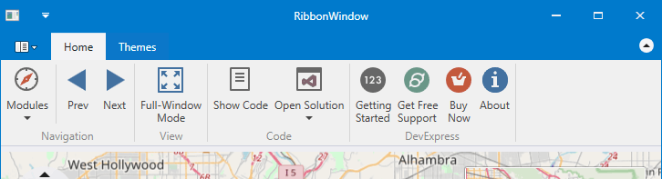
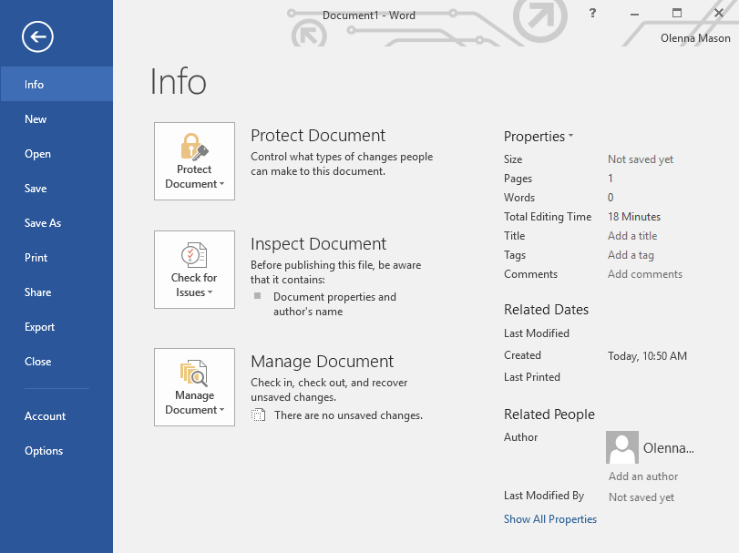
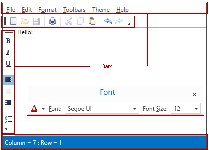

```csharp
<dx:ThemedWindow x:Class="HAceMaker.MainWindow"
        xmlns:dx="http://schemas.devexpress.com/winfx/2008/xaml/core">
```
`dx:` DevExpress의 core 네임스페이스에 있는 컨트롤을 쓰겠다는 의미의 **XAML 접두사**를 명시
코드비하인드도 동일하게 맞춰줘야 한다.
```csharp
public partial class MainWindow : ThemedWindow
{
    public MainWindow()
    {
        InitializeComponent();
    }
}
```
## Themes
컨트롤들이 **어떤 디자인 규칙으로 그려질지**를 정의한다.

### 테마 설치
#### 1) Package Manager Console에서 설치하기

1. **Tools → NuGet Package Manager → Package Manager Console**
    
2. **콘솔 창 입력**
   `Install-Package DevExpress.Wpf.Themes.원하는테마 -Version @@`

#### 2) GUI로 설치하기
1. **솔루션 탐색기→프로젝트 우클릭→NuGet 패키지 관리→찾아보기**
    
2. **검색**
   `DevExpress.Wpf.Themes.원하는테마` 
### 의존성 설치
- `Install-Package DevExpress.Wpf.Core -Version 25.2.4`
###  `App.xaml.cs`
```csharp
using DevExpress.Xpf.Core;
public partial class App : System.Windows.Application
{
    protected override void OnStartup(StartupEventArgs e)
    {
        ApplicationThemeHelper.ApplicationThemeName = Theme.Win10DarkName;
        base.OnStartup(e);
    }
}
```

## Ribbon
많은 버튼들을 그룹으로 묶어서 상단에 정리해 보여주는 UI
버튼에 Backstage를 연결하면 관련 메뉴에 대한 화면으로 전환해서 보여준다.


#### Package Manager Console에서 설치하기

1. **Tools → NuGet Package Manager → Package Manager Console**
    
2. **콘솔 창 입력**
   `Install-Package DevExpress.Wpf.Ribbon -Version 25.2.4`

## Backstage
리본에서 메뉴를 눌렀을 때 별도의 **화면 전환**을 제공
**Info 메뉴를 눌렀을 때 나타나는 Backstage 화면 예시**

## Bar
- **MainMenuControl**
  **계층(카테고리 → 하위 메뉴)** 구조
  `파일/편집/보기` 같은 최상위가 있고, 그 아래에 `열기/저장/종료` 같은 항목이 드롭다운으로 붙는 형태
- **ToolBarControl**
  **한 번 클릭으로 즉시 실행** 용도(저장, 새로고침)




#### 드롭다운 배치 설정
##### `App.xaml.cs`
```csharp
public partial class App : System.Windows.Application
{
    protected override void OnStartup(StartupEventArgs e)
    {
        BarManager.IgnoreMenuDropAlignment = true;
    }
}
```


