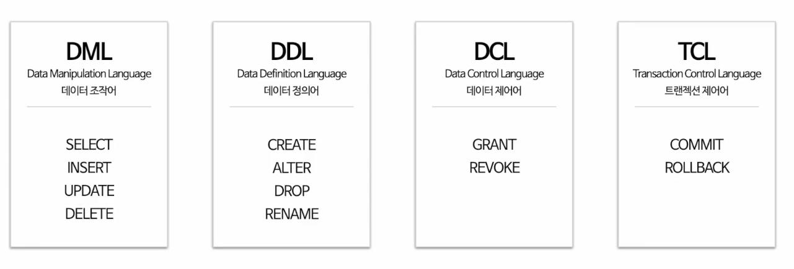
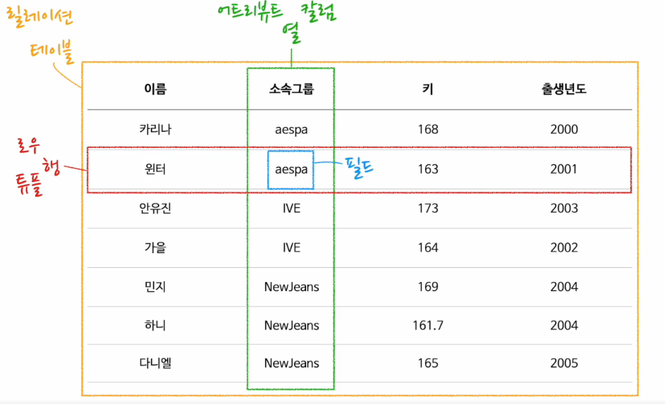
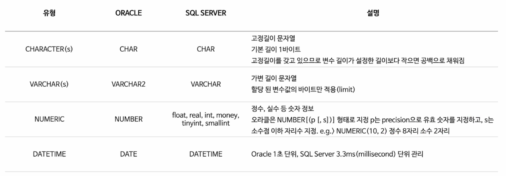
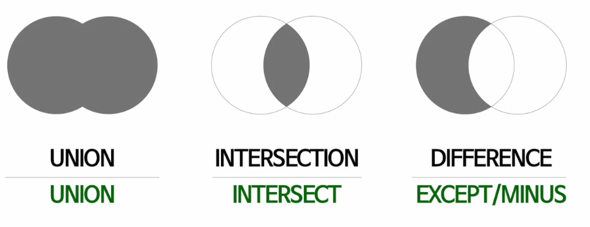
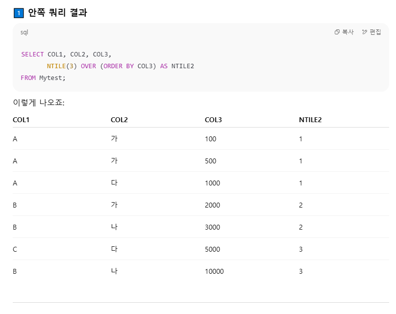

> SQLD 시험 준비 과정에서 정리했던 학습 노트입니다.
> 개념, 문제 풀이 메모를 한 곳에 모아두기 위해 작성했습니다.
### 명령어

#### DROP / TRUNCATE / DELETE 차이
| DROP              | TRUNCATE              | DELETE                |
| ----------------- | --------------------- | --------------------- |
| DDL               | DDL                   | DML                   |
| Rollback 불가능      | Rollback 불가능          | Commit 이전 Rollback 가능 |
| Auto Commit       | Auto Commit           | 사용자 Commit            |
| 테이블 정의 자체를 완전히 삭제 | 테이블을 최초 생성된 초기 상태로 만듦 | 데이터만 삭제               |
|                   | 특정 행 선택 삭제 불가(전체 행만)  | 특정 행 삭제 가능            |
### 트랜잭션
|특성|설명|
|---|---|
|원자성(atomicity)|트랜잭션 연산은 **모두 성공**하거나 **전혀 실행되지 않은 상태**여야 한다.|
|일관성(consistency)|실행 전 DB가 정상이라면 실행 후에도 **일관성**이 유지되어야 한다.|
|고립성(isolation)|실행 도중 **다른 트랜잭션의 영향**으로 잘못된 결과가 나오면 안 된다.|
|지속성(durability)|성공적으로 수행되면 변경 내용은 **영구 저장**된다.|
#### 읽기 이상 현상
- **Dirty Read**: 다른 트랜잭션이 수정했지만 아직 커밋되지 않은 데이터를 읽는 현상
- **Non-Repeatable Read**: 같은 쿼리를 두 번 했는데 그 사이 수정/삭제로 결과가 달라지는 현상
#### 용어 정리
- **트랜잭션**: 분리될 수 없는 1개 이상의 DB 조작(논리적 연산 단위)
- **커밋(Commit)**: 변경사항을 DB에 **영구 반영**
- **롤백(Rollback)**: 변경사항을 **폐기**하고 이전 상태로 복구
### 테이블

### 데이터 유형

### NULL
- NULL은 **모르는 값 / 값의 부재**
- NULL과의 모든 비교는 알 수 없음(Unknown)을 반환
- **공백 문자 혹은 숫자 0이 아님**
### 외래키(FK)
- 테이블 생성 시 설정 가능
- 외래키 값은 **NULL 가능**
- 한 테이블에 **여러 개 존재 가능**
- 참조 무결성 제약을 받을 수 있음
### 인덱스(Index)
- 인덱스를 사용하면 원하는 값을 **빠르게 탐색** 가능
- 기본키는 자동으로 인덱스가 생성되며 이름을 부여할 수도 있음
### 데이터 모델링
- **현실 세계의 데이터를 추상화**하여 **데이터 구조로 표현**하는 것
- **시스템 구현**을 포함한 **업무분석** 및 **업무형상화**를 하는 목적으로 사용
- **복잡한 현실**을 **제한된 언어나 표기법**을 통해 이해하기 쉽게 하는 **단순화**의 의미를 가지고 있음
- **누구나 이해가 가능하도록** 정확하게 현상을 기술하는 **정확화**의 의미를 가짐
- **업무 정보를 구성하는 기초가 되는 정보들**에 대해 **일정한 표기법으로 표현**
- **분석된 모델**을 가지고 **데이터베이스를 생성하여 개발 및 데이터관리**에 사용
- **데이터모델링 자체**로서 **업무의 흐름을 설명하고 분석**하는 데 의미가 있음

>"**데이터모델링**이라는 것은 단지 **데이터베이스만을 구축 하기 위한 용도로 쓰이는 것이 아니라** 데이터 모델링 자체로서 **업무를 설명하고 분석하는 부분에서 매우 중요한 의미**를 가지고 있다.
#### 데이터 모델링 유의점

| 종류                       | 설명                                                               |
| ------------------------ | ---------------------------------------------------------------- |
| **중복성** (Duplication)    | 여러 장소의 DB에 **같은 정보를 반복 저장**하지 않도록 **중복을 최소화** (동일 정보 여러 곳에 저장 X) |
| **비유연성** (Inflexibility) | **데이터 정의**와 **데이터 사용 프로세스는 분리**                                  |
| **비일관성** (Inconsistency) | **데이터 간의 연관 관계를 명확히 하여** 항상 **일관성 있게 유지**                        |

> **프로그램과 테이블의 연계성이 너무 높아지면** 테이블 구조가 조금만 바뀌어도 **프로그램 수정이 필수**
   **데이터 모델이 업무 변화에 취약해지는 단점**이 되므로 **연계성이 높아지면 안됨**
#### 데이터 모델링의 3단계

|단계|설명|
|---|---|
|**개념적 모델링**|**추상화 개념 ↑, ** **업무 중심적**, **포괄적인 수준의 모델링**을 진행 <br />**전사적 데이터 모델링, EA수립**시 많이 이용|
|**논리적 모델링**|**Key, 속성, 관계**를 **명확히 정의**, **재사용성 ↑ **<br />구체적인 **업무 중심의 모델링**과 **정규화를 수행**하는 단계|
|**물리적 모델링**|**실제 데이터베이스**에 **이식 가능**하도록 **물리적인 성격(성능, 데이터 저장 방법 등)을 고려하여 설계**|
#### 데이터 모델링의 3요소
- 업무가 관여하는 **어떤 것(Things)**
- 업무가 관여하는 **어떤 것의 성격(Attributes)**
- 업무가 관여하는 **어떤 것의 관계(Relationships)**
#### 데이터 모델링 세가지 관점
- **데이터 관점**  
    **업무**가 **어떤 데이터**와 **관련**이 있는지 **데이터 간의 관계**는 무엇인지에 대해서 모델링 하는 관점
- **프로세스 관점**  
    **업무가 실제로 하고 있는 일**은 무엇인지 무엇을 해야 하는지를 모델링 하는 관점
- **데이터와 프로세스의 상관 관점**  
    **업무가 처리하는 일의 방법에 따라** **데이터는 어떤 영향을 받는지** 모델링하는 관점
#### 데이터 모델링 특징
- **실제 데이터베이스 구축** 시 **참고되는 모델**은 **물리적 데이터 모델링**이다.
- **개념 모델링 - 논리 모델링 - 물리 모델링** **단계**로 갈수록 **구체적**이다.
### 데이터모델링의 관계
- **관계**는 **존재적** 관계와 **행위**에 의한 관계로 **구분**
- **ERD**에서는 **존재와 행위를 구분X** , **단일화된 표기법 사용**
- **UML**에서의 **클래스다이어그램**의 관계는 **연관관계**와 **의존관계**가 있고  
    이것을 **실선과 점선의 표기법**으로 **다르게 표현** (**단일화된 표기법 사용X**)
#### 관계에 대한 설명
- **관계 표기법**은 **관계명, 관계차수, 선택성(선택사양)** 의 **3가지 개념**을 **사용**
- **관계**는 **존재적** 관계와 **행위**에 의한 관계로 구분
#### 관계 표기법

|구분|설명|
|---|---|
|**관계명(Membership)**|관계의 이름|
|**관계차수(Cardinality)**|1:1, 1:M, M:N|
|**관계선택사양(Optionality)**|필수관계, 선택관계|
#### 두 개의 엔터티 사이에 정의한 관계를 체크하는 사항 4가지
- 두 개의 엔터티 사이에 **연관규칙**이 존재하는가?
- 두 개의 엔터티 사이에 **정보의 조합**이 발생되는가?
- 관계연결을 가능하게 하는 **동사(Verb)** 가 있는가?
- 관계연결에 대한 **규칙**이 **서술**되어 있는가?
### 데이터베이스 스키마구조 3단계

|**스키마 종류**|**설명**|
|---|---|
|**외부 스키마** (External Schema)|**사용자 관점**<br/>**업무상 관련이 있는 데이터만 접근**<br/>**응용 프로그램이 접근하는 데이터베이스를 정의**<br/>관련 데이터베이스의 뷰[View]를 표시|
|**개념 스키마** (Conceptual Schema)|**설계자 관점**<br/>사용자 전체 집단의 데이터베이스 구조[**통합 데이터베이스 구조**]<br/>전체 **데이터베이스 내의 규칙과 구조**를 표현|
|**내부 스키마** (Internal Schema)|**개발자 관점**<br/>**데이터베이스의 물리적 저장 구조 표현**<br/>데이터 저장 구조, 레코드 구조, 필드 정의, 인덱스 등을 의미|
### ERD 작성 순서
**1. 엔터티를 그린다.**  
**2. 엔터티를 적절히 배치한다.**  
**3. 엔터티 간 관계를 설정한다.**  
**4. 관계명을 기술한다.**  
**5. 관계 참여도를 기술한다.**  
**6. 관계의 필수 여부를 기술한다.**

> 1976년 **피터첸(Peter Chen)**에 의해 **Entity-Relationship Model(E-R-Model)** 표기법이 만들어졌다.  
> 엔터티를 어디에 배치하는가에 대한 문제는 필수사항은 아니지만 **가장 중요한 엔터티**는  
> 왼쪽 상단에서 조금 아래쪽 중앙에 배치한다.
### 엔터티
#### 기본엔터티(키엔터티)
- **독립적으로 생성**이 가능하다.(**다른 엔터티**와의 **관계에 의해 생성 X**)
- **다른 엔터티**로부터 **주식별자를 상속받지 않고** **자신의 고유한 주식별자를 가지게 된다**.
- **사원, 부서, 고객, 상품, 자재** 등이 **기본엔터티**가 될 수 있다.
#### 중심 엔터티
- **기본 엔터티**와 **행위 엔터티**를 **연결하는 역할**
- **업무 프로세스의 중심**에 위치
- **매출, 주문, 계약** 등이 **중심엔터티**가 될 수 있다.
#### 행위 엔터티
- **2개 이상의 엔터티로부터 발생**된다.
- **주문이력, 체결이력** 등이 **행위엔터티**가 될 수 있다.
#### 교차 엔터티
- **M:N(다:다) 관계**를 **해소**하기 위해서 **인위적으로 만들어진 엔터티**이다.
#### 엔터티의 특징
- 반드시 **해당 업무에서 필요**하고 **관리하고자 하는 정보**여야 한다. ex) 환자, 토익 응시횟수 등
- **유일한 식별자**에 의해 **식별이 가능**해야 한다.
- **영속적**으로 존재하는 **두 개 이상의 인스턴스의 집합**이어야 한다. ("한 개"가 아니라 **"두 개 이상"**)
- 엔터티는 **업무 프로세스**에 의해 **이용**되어야 한다.
- 엔터티는 반드시 **속성**이 있어야 한다.
- 엔터티는 **다른 엔터티**와 **최소 한 개 이상**의 **관계**가 있어야 한다.
#### 엔터티 명명 방법
- **현업업무**에서 **사용하는 용어**
- **약어** **사용**X
- **단수명사** **사용**
- **유일한 이름** 부여
- **엔터티가 생성되는 의미대로** **자연스럽게** 부여
### 속성 (ATTRIBUTE)
- 업무에서 필요로 하는 **인스턴스에서** 관리하고자 하는 의미상 **더 이상 분리되지 않는 최소의 데이터 단위**
- **엔터티에 대한 자세하고 구체적인 정보를 나타낸다**.
- **하나의 엔터티**는 **두 개 이상의 속성**을 갖는다.(**1엔터티 2속성**)
- **하나의 엔터티**는 **두 개 이상의 인스턴스**를 갖는다.(**1엔터티 2인스턴스**)
- **하나의 속성**은 **하나의 속성값을 가져야 한다**.(**1속성 1속성값**)
- **속성도 집합**이다.
#### 속성 명명 방법
- **약어** **사용X**
- **서술식 용어** **사용X**
- **현업업무**에서 **사용하는 용어**
- **복합 명사**를 **사용**하여 **유일성** 확보

|구분|설명|
|---|---|
|명사|직원(EMPLOYEE) 테이블 → 이름 속성명: `NAME` <br />고객(CUSTOMER) 테이블 → 이름 속성명: `NAME`<br />**동일한 속성명**을 쓰면 **혼란 초래**|
|복합 명사|직원(EMPLOYEE) 테이블 → 이름 속성명: `EMP_NAME`<br />고객(CUSTOMER) 테이블 → 이름 속성명: `CUST_NAME`<br />**복합명사**를 **사용**하여 **구분 가능하게** 함|
#### 속성의 종류

|구분|설명|
|---|---|
|**기본 속성**|**기본적인 모든 속성** (ex. 원금, 예치기간, 이자율)|
|**설계 속성**|**업무를 규칙화하기 위해** **새로 만들거나 변형, 정의**하는 속성 <br />(예금분류 ex. 일반예금,특별예금 등)|
|**파생 속성**|**다른속성의 영향을 받아 만들어지는** 속성 <br />**데이터를 조회할 때 빠른 성능을 낼 수 있도록** 원래 속성의 값을 계산하여 저장할 수 있도록 만든 속성 (ex. 이자)|
### 도메인(Domain)
- **엔터티의 속성**이 **가질 수 있는 값의 범위**
- **엔터티 속성**에 대해서 **어떤 유형의 값이 들어가는지 제약 사항을 정의**한다.
- **속성**을 **명사**로 분리한다.
- **공통**으로 발생하는 **명사**는 **하나의 도메인으로 생성**한다.

|예시|
|---|
|**주문이라는 엔터티**가 있을 때 **단가**라는 **속성 값의 범위**는 **100에서 10,000 사이의 실수 값**이며 <br />**제품명이라는 속성**은 **길이**가 **20자리 이내의 문자열**로 정의할 수 있다.|
### 식별자의 종류
- 엔터티 내에서 **대표성**을 가지는가에 따라 **주식별자**와 **보조식별자**로 구분
- 엔터티 내에서 **스스로 생성되었는지 여부**에 따라 **내부식별자**와 **외부식별자**로 구분
- **단일 속성으로 식별이 되는가**에 따라 **단일식별자**와 **복합식별자**로 구분
- 원래 업무적으로 있던 식별자 속성을 **대체**하여 새롭게 만든 식별자를 구분하기 위해  
    **본질식별자**와 **인조식별자**로 구분  
    **본질 식별자** : **업무**에 의해(비즈니스 프로세스에 의해) 만들어지는 식별자  
    **인조 식별자 : 인위적**으로 만들어진 식별자
#### 식별 관계 & 비식별 관계

|구분|설명|
|---|---|
|**식별 관계**|**강한 연결 관계**, **부모 엔터티에 종속**|
|**비식별 관계**|**약한 연결 관계**, **부모 엔터티**로부터 **속성**을 **받았지만** **주식별자**로 **사용하지 않고** <br />**일반적인 속성으로만 사용**, 엔터티 간의 관계를 **점선**으로 표현|
#### 주식별자의 특징

|구분|설명|
|---|---|
|**유일성**|**주식별자에 의해** 엔터티 내의 **모든 인스턴스들이 유일하게 구분**되어야 함|
|**최소성**|**주식별자를 구성하는 속성의 수**는 **유일성을 만족하는 최소의 수**가 되어야 함|
|**불변성**|지정된 **주식별자의 값**은 **변하지 않아야 함**|
|**존재성**|**주식별자**가 지정이 되면 **반드시 값이 있어야 함 (Null 안됨)**|
### 성능 데이터모델링
- **데이터베이스 성능 향상을 목적**으로 **설계단계의 데이터모델링** 때부터 **성능과 관련된 사항이 데이터모델링에 반영될 수 있도록** 하는 것
- **데이터의 증가가 빠를수록 성능저하**에 따른 **성능개선비용**이 **증가**
- **분석/설계 단계**에서 **성능을 고려**한 **데이터모델링을 수행할 경우** **성능저하에 따른 비용**을 **최소화 할 수 있음**
- **데이터모델**은 **성능**을 **튜닝**하면서 **변경**이 **될 수 있음**
- _문제 발생 시점의 SQL을 중심으로 집중 튜닝하는 것은 성능 데이터모델링과 무관함
#### 성능 데이터모델링 수행 절차
- **첫번째**, 데이터모델링을 할 때 **정규화**를 정확하게 수행한다.
- **두번째**, 데이터베이스 **용량산정**을 수행한다.
- **세번째**, 데이터베이스에 발생되는 **트랜잭션의 유형을 파악**한다.
- **네번째**, 용량과 트랜잭션의 유형에 따라 **반정규화**를 수행한다.
- **다섯번째**, 이력모델의 조정, **PK/FK 조정**, **슈퍼타입/서브타입 조정** 등을 수행한다.
- **여섯번째**, 성능관점에서 **데이터모델을 검증**한다.
### 정규화란
- 데이터 중복을 감소시키는 것
#### 정규화 종류
- **제 1 정규화** : **속성의 중복값** 제거
- **제 2 정규화** : **부분 함수 종속** 제거
- **제 3 정규화** : **이행 함수 종속** 제거(**기본키**를 **제외**하고 **칼럼 간에 종속성**이 발생하면 제거)
- **제 4 정규화** : **다치종속성** 제거
##### 이상 현상
- **정규화를 수행하지 않고** 엔터티에 **데이터를 입력할 때** 불필요한 데이터를 같이 입력하거나 삭제하면 **다른 데이터까지 같이 삭제**되는 문제
### 반정규화
- 반정규화는 **데이터를 중복**시켜서 데이터베이스의 **성능을 향상**시키는 기술이다.
- **정규화된 데이터 모델**에서 **중복, 통합, 분리** 등을 **수행**하는 모든 과정을 의미한다.
- 반정규화를 수행하면 여러 개의 테이블에 **중복 데이터를 허용하기 때문에 무결성 보장이 어렵다.**
#### 반정규화 적용 판단 기준
- 데이터를 조회할 때 **디스크 I/O량이 많아서 성능이 저하**될 때 → **디스크 I/O**를 **줄이기 위해** **부분테이블**을 **추가**한다.
- **경로가 너무 멀어 조인으로 인한 성능저하**가 예상될 때
- 컬럼을 **합계 및 평균 등을 계산하여 읽을 때** **성능이 저하**될 것이 예상될 때
- **여러 개**의 **테이블 조인**으로 인한 **성능 저하**가 예상될 때
- 대용량 데이터 Query 실행 시 **데이터 입출력 속도**가 느릴 때
#### 반정규화 기법
##### 칼럼 반정규화 기법
- **중복칼럼** 추가
- **파생칼럼** 추가
- **이력테이블 칼럼** 추가
- **PK**에 의한 **칼럼** 추가
##### 중복 관계 추가 기법
- **데이터 무결성**을 **깨뜨릴 위험을 갖지않고서도** **데이터처리의 성능을 향상**시킴
##### 파티셔닝 기법
- **논리적으로는** **하나의 테이블**이지만 **물리적으로는** **여러 개의 테이블**로 분리하여 **데이터 액세스 성능을 향상**시키고, **데이터 관리**도 **개선**하는 기법

**테이블 병합**
- **슈퍼타입**과 **서브타입** 관계에서 **하나의 테이블로 통합**
- 두 개의 엔터티가 1대1 또는 1대N 관계인 경우 하나의 테이블만 생성하도록 반정규화

**수직 분할**
- **하나의 테이블을 두 개 이상의 테이블로 분할**하여 **디스크 I/O을 줄일 수 있는** 방법
### 집합 연산자


|집합 연산자|특징|
|---|---|
|**UNION**|중복된 행은 제거하는 합집합|
|**UNION ALL**|중복제거를 하지 않고 합집합|
|**INTERSECT**|교집합|
|**EXCEPT**|차집합|
#### UNION & UNION ALL

|구분|UNION|UNION ALL|
|---|---|---|
|**중복 제거**|중복된 행은 제거|중복된 행도 모두 포함|
|**속도**|중복제거(Distinct) 때문에 성능 저하 발생|중복제거를 하지 않기 때문에 상대적으로 빠름|
|**정렬**|정렬 O|정렬 X|
### 인덱스(Index)
- 인덱스를 사용해서 접근하면 원하는 값을 빠르게 탐색할 수 있다.
- 기본키는 자동으로 인덱스가 생성되며 인덱스 이름을 부여할 수도 있다.
하나의 ROW만 저장되어있을때 유리한 스캔 방식 - Table Full Scan

Sort Merge 방식의 조인이 Nested Loop 방식 조인보다 효율적으로 판단되는 경우는?

- 외래키에 인덱스가 없을때
#### HASH JOIN
- 해시 조인은 **CPU 연산**이 **많이 발생되는 조인**으로 조인을 할 때 **선행 테이블의 크기가 작아야 유리하다**.
- **인덱스**가 **존재하지 않아도** **사용할 수 있다**.
- 해시 함수를 이용하여 조인을 수행하기 때문에 **'='로 수행하는 조인인 동등조건에서만 사용할 수 있다**.
- 해시 테이블을 저장할 때 메모리에 적재할 수 있는 영역의 크기보다 커지면 **임시 영역(디스크)에 저장**한다.
- 해시 조인은 **랜덤 액세스가 발생하지 않는다.**
#### NATURAL JOIN
- 두 테이블 간에 동일한 컬럼 이름을 가지는 것을 모두 출력하는 조인 방식
### 분산 데이터베이스
- **마스터 데이터**는 **분산 데이터베이스**에 **복제 분산**을 **적용**
- **실시간 업무적인 특성**을 가지고 있을 때 **분산 데이터베이스**를 **사용**하여 구성
- **백업 사이트를 구성**할 때 간단하게 **분산 기능**을 **적용**하여 구성
- **빠른 응답 속도**와 **통신 비용 절감**
- **오류 잠재성 증대, 처리 비용 증가가 단점임**
- **무결성 보장이 어려움**
#### 분산 데이터베이스 투명성 종류
- **분할 투명성**  
    하나의 엔터티가 여러개의 분산 데이터베이스에 저장되어 있지만 사용자는 그 내용을 알 필요가 없다.
- **위치 투명성** 
    데이터의 저장 장소 명시가 불필요하다는 특성
- **지역 투명성**
- **중복 투명성**  
    여러 데이터베이스에 중복되어서 데이터가 저장되는 것이다.
- **병행 투명성**
    여러 개의 분산 데이터베이스에서 동시에 트랜잭션이 실행되는 것이다.
- **장애 투명성**
### 파티션 기법
#### Range Partition
- **날짜 및 숫자**처럼 **연속된 데이터 값의 범위**를 **기준**으로 파티션을 수행하는 기법
#### List Partition
- 파티셔닝할 항목을 **관리자가 직접 지정**해서 파티션을 수행하는 기법
- 쉽게 **데이터를 삭제할 수 없다.**
### ERD 작성 순서
- 엔터티를 **그린다.**
- 엔터티를 적절하게 **배치한다.**
- 엔터티 간의 **관계를 설정한다.**
- 관계명을 **기술한다.**
- 관계의 **참여도를 기술한다.**
- 관계의 **필수 여부를 기술한다.**
### 절차형 SQL
- PROCEDURE
- TRIGGER
- DEFINED FUNCTION
### 순위 관련 함수
#### RANK()
- 동일 값 → 동일 순위 부여
- 다음 순위는 건너뛴다(스킵된다)
예시:

|값|RANK()|
|---|---|
|100|1|
|100|1|
|90|3|
|80|4|
#### DENSE_RANK()
- 동일 값 → 동일 순위 부여
- 다음 순위는 스킵하지 않음
예시:

|값|DENSE_RANK()|
|---|---|
|100|1|
|100|1|
|90|2|
|80|3|
#### ROW_NUMBER()
- 그냥 **순번 매기기** (무조건 1,2,3,…)
- **동일한 우선순위가 나와도 고유의 값 부여**
### 문제풀이(오답노트)
#### 116페이지 45번
1. NTILE(3) 3개의 그룹으로 나누겠다는 의미
  COL3 값을 기준으로 정렬할거고 그것을 NTILE2라고 명칭 
  총 7행을 행 나눔 할건데 홀수이므로 앞에 행부터 채우기 때문에 3행,2행,2행으로 나누고 
  순서는 NTILE2에 부여
2. SELECT NTILE2 , COUNT(*) 이므로 NTILE2 순서에 따른 값을 가져옴
3. NTILE2 순서가 1인 애는 3개이므로 CNT는 3 
   (ㄱ) 1 (ㄴ) 3

|NTILE2|CNT|
|---|---|
|(ㄱ)|(ㄴ)|
|2|2|
|3|3|


#### 117페이지 48번
1. `EXTRACT`로 2020 추출
```sql
SELECT EXTRACT  
(YEAR FROM SYSDATE)   -- 첫번째 SELECT 문에서 연도 2020 추출
```
- `SYSDATE` → **현재 시스템 날짜** (예: 2025-08-21)
- `EXTRACT(MONTH FROM SYSDATE)` → 해당 날짜의 **월(Month)** 추출
2. LPAD 함수로 2에 '0' 채워넣어서 02로 만들어주기
```sql
LPAD(EXTRACT(month from sysdate),ㄱ,ㄴ)
```
**`LPAD(값, 길이, 채울문자)`**
- `EXTRACT(month from sysdate)` 2 추출
- `길이` = 2 → 02로 만들기 위해
- `채울문자` = '0' → 여기서 `'0'`은 문자임, 숫자 `0`이라고 쓰면 인식 못해서 오류 발생
#### 128페이지 17번
1. **하나라도 NULL이면 그 행은 NULL** 처리됨 
   10 + 20 + 10 + 10 = 50 ✅ 
   20 + 20 + NULL + 20 = NULL ❌ 
   30 + NULL + 30 + NULL = NULL ❌ 
   NULL + 40 + 10 + 40 = NULL ❌ 
   SUM() → NULL 제외하고 합: 50 
   첫 번째 쿼리 결과: **50**
```sql
SELECT SUM(C1 + C2 + C3 + C4)  
FROM Mytest17;
```
2. **각 컬럼별 SUM 계산 (NULL 무시)** 
   SUM(C1) = 10 + 20 + 30 = 60
    SUM(C2) = 20 + 20 + 40 = 80
    SUM(C3) = 10 + 30 + 10 = 50
    SUM(C4) = 10 + 20 + 40 = 70
    합: 60 + 80 + 50 + 70 = 260
```sql
SELECT SUM(C1) + SUM(C2) + SUM(C3) + SUM(C4)  
FROM Mytest17;
```
#### 129페이지 19번

1. 
```sql
SELECT *   
FROM MYTEST  
WHERE NCOL1 = 4  
START WITH NCOL2 IS NULL  
CONNECT BY PRIOR NCOL1 = NCOL2;
```
- **START WITH NCOL2 IS NULL** → NCOL2가 NULL인 행부터 시작
    - 테이블에서 NCOL2=NULL인 행 → **NCOL1=1, NCOL2=NULL, CCOL3=A, CCOL4=NULL**
      이 행이 **부모 노드**가 됨

- **CONNECT BY PRIOR NCOL1 = NCOL2**
    - PRIOR가 붙었으므로 NCOL1 → 부모 노드
    - NCOL2 → 자식 노드
    - 조건: **부모 NCOL1 = 자식 NCOL2**
    **첫번째 루트 노드**: NCOL1=1
    - 자식 찾기 → 테이블에서 NCOL2=1인 행
    - 해당 행: **NCOL1=2, NCOL2=1, CCOL3=B, CCOL4=A**
    - 조건 만족
    **다음 단계**: NCOL1=2
    - 자식 찾기 → 테이블에서 NCOL2=2인 행
    - 해당 행: **NCOL1=4, NCOL2=2, CCOL3=D, CCOL4=B**
    - 조건 만족
    **다음 단계**: NCOL1=4
    - 자식 찾기 → NCOL2=4인 행
    - 해당 행: **NCOL1=5, NCOL2=4, CCOL3=E, CCOL4=D**
    - 조건 만족
    WHERE 절의 영향
    - 쿼리에 **`WHERE NCOL1=4`**가 있음
    - 트리 전체가 계산된 후 **NCOL1=4인 행만 필터링**
    - 그래서 최종 결과: **4,2,D,B** ✅
2. 
```sql
SELECT *   
FROM MYTEST   
START WITH CCOL3 = 'B'  
CONNECT BY PRIOR NCOL1 = NCOL2 AND PRIOR CCOL3 ='B';
```
- **START WITH CCOL3='B'** → CCOL3 값이 B인 행부터 시작 
  **NCOL1=2, NCOL2=1, CCOL3=B, CCOL4=A**
    
- **CONNECT BY PRIOR NCOL1=NCOL2 AND PRIOR CCOL3='B'** 
  CCOL3='B' 조건이 맞는 행이 NCOL1=2, NCOL2=1, CCOL3=B, CCOL4=A 밖에 없으므로 최종 결과: **2,1,B,A** ✅
3. 
```sql
SELECT *   
FROM MYTEST  
START WITH CCOL3 = 'B'  
CONNECT BY PRIOR NCOL1 = NCOL2 AND PRIOR CCOL4 = 'B';
```
- **START WITH CCOL3='B'** → CCOL3 값이 B인 행부터 시작 
  **NCOL1=2, NCOL2=1, CCOL3=B, CCOL4=A**
- **PRIOR NCOL1 = NCOL2 AND PRIOR CCOL4='B'** 
  NCOL1=2, NCOL2=1, CCOL3=B, CCOL4=A 이 상태에서 탐색 시작
  `NCOL1=2`이니까 부모와 값이 같은 `NCOL2=2`를 찾아야함 그리고 `CCOL4=B`가 성립되는 행을 찾아야 하는데 일치하는게 없으므로 최종 결과는 기존 시작 행이 출력됨 
  최종 결과: **2,1,B,A** ✅ (??!)
#### 141페이지 36번
1번이 틀린 이유
```sql
CREATE TABLE T_ORDER (  
  C1 NUMBER(10),  
  C2 DATE,  
  C3 VARCHAR(10),  
  C4 NUMBER DEFAULT 1000  
);
```
여기서 **C4 컬럼은 DEFAULT 1000** 이 설정되어 있다.

**보기 1번(잘못된 방식)**
```sql
INSERT INTO T_ORDER VALUES (2, SYSDATE-1, 'ABC');   
-- ORA-00947: not enough values
```
구문이 `INSERT INTO 테이블 VALUES(...)` 형태일 때 **테이블의 모든 컬럼 개수와 값의 개수가 반드시 일치**해야 한다.

**올바른 방식(default 적용되는)**
```sql
INSERT INTO T_ORDER (C1, C2, C3) VALUES (2, SYSDATE-1, 'ABC');  
-- C4는 자동으로 DEFAULT 1000 들어감
```
C4 컬럼에 기본값 1000 이 들어가게 하기 위해서는 각 컬럼 별로 값을 지정해주고 컬럼 C4를 생략해야 자동으로 값이 들어간다.
#### 142페이지 40번
```sql
SELECT AVG(COL3) FROM SQLD01;   
SELECT AVG(COL3) FROM SQLD01 WHERE COL1 > 0;   
SELECT AVG(COL3) FROM SQLD01 WHERE COL1 IS NOT NULL;
```
- ###### 1. `SELECT AVG(COL3) FROM SQLD01;`
    - **AVG 함수 특징**
        - NULL 값은 **계산에서 제외**됨
    - COL3 값: 20, 0, NULL → NULL 제외
    - 평균 계산: `(20 + 0) / 2 = 10`
    - 결과: **10**
    
- ###### 2. `SELECT AVG(COL3) FROM SQLD01 WHERE COL1 > 0;`
    - 조건: `COL1 > 0` → COL1 값이 0보다 큰 행만
    - COL1 값: 30, NULL, 0 → 조건 만족: **30 행만**
    - COL1 값이 0보다 큰 라인에 COL3 값은? 20
    - 평균: 20 / 1 = 20
	- 결과: **20**
    
- ###### 3. `SELECT AVG(COL3) FROM SQLD01 WHERE COL1 IS NOT NULL;`
    - 조건: `COL1 IS NOT NULL` → COL1이 NULL이 아닌 행
    - COL1 값: 30, NULL, 0 → 조건 만족: **30, 0 행**
    - COL3 값: 20, NULL → NULL 제외
    - 평균: 20 / 1 = 20
    - 결과: **20**
#### 145페이지 47번
```sql
SELECT ENAME, SAL,  
( ) OVER (ORDER BY ENAME) AS SAL1  
FROM EMP;
```
- `( ) OVER (ORDER BY ENAME)` → **윈도우 함수**를 사용
- 결과 컬럼 `SAL1`을 보면:
```sql
SAL1: 1100, 950, 3000, 1300, 1600
```
#### 결과 분석

|ENAME|SAL|SAL1|
|---|---|---|
|test10|1500|1100|
|test11|1100|950|
|test12|950|3000|
|test13|3000|1300|
|test14|1300|1600|
SAL1 값이 **SAL 자체와 바로 일치하지 않고**, ENAME 순으로 정렬 후 **이전/다음 행의 SAL 값**과 관련 있어 보임
대표적인 윈도우 함수 후보:
- `LAG(SAL, 1)` → 이전 행 값
- `LEAD(SAL, 1)` → 다음 행 값
1은 생략 가능하므로 최종 정답 `LEAD(SAL)`