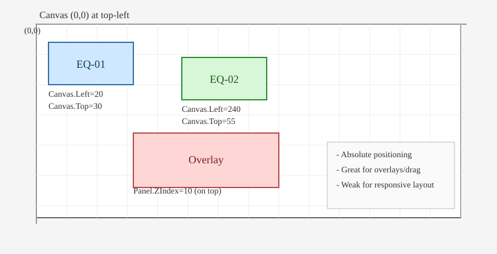
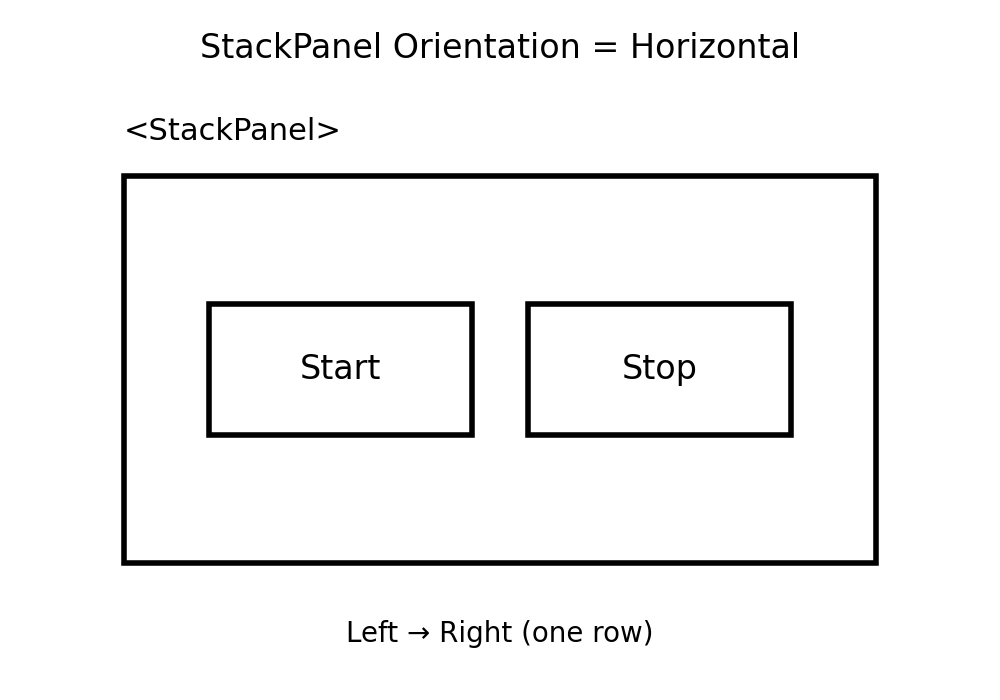
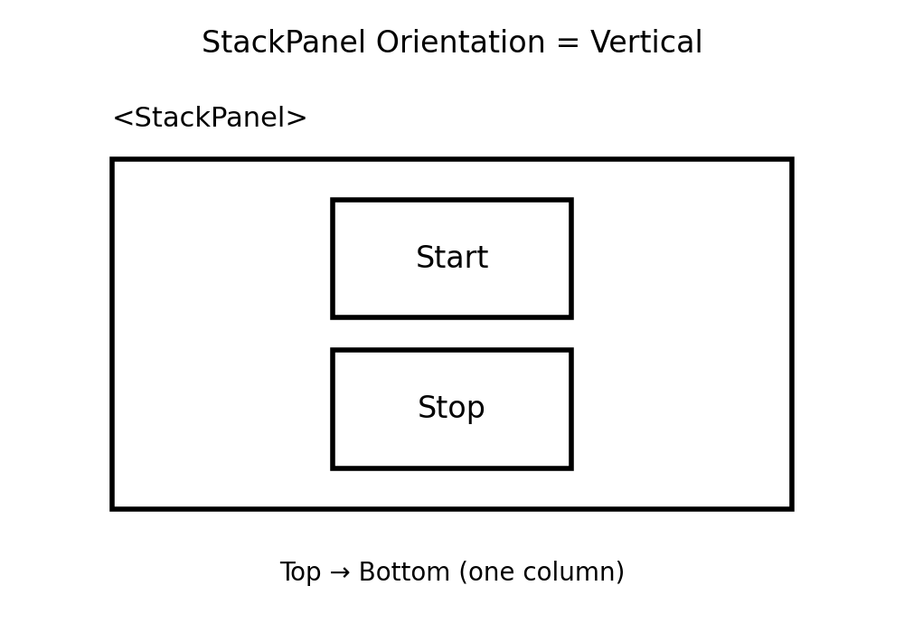
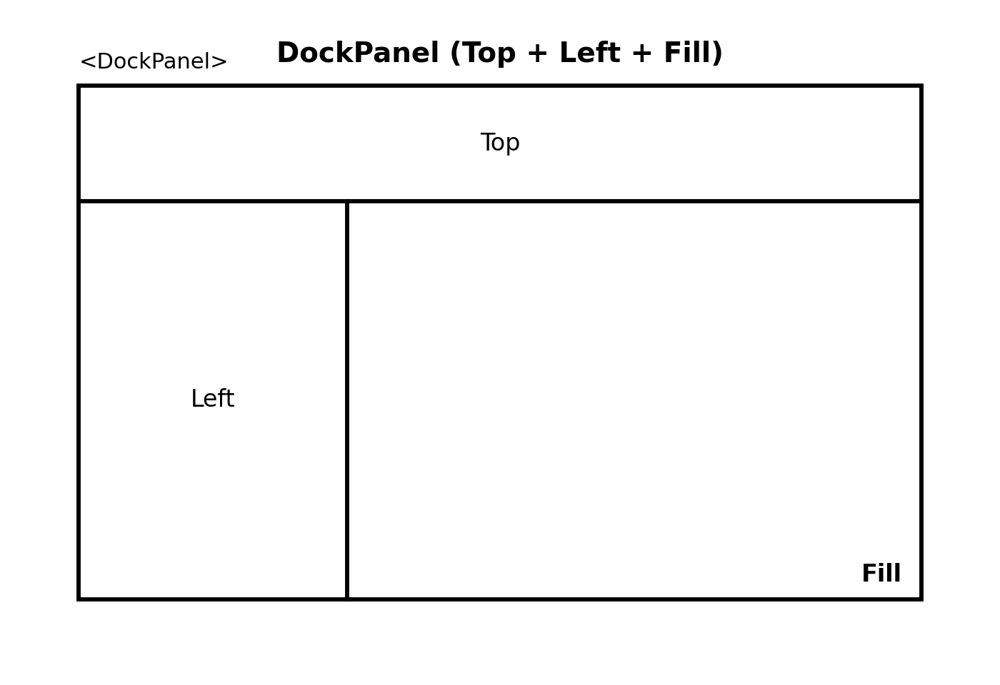
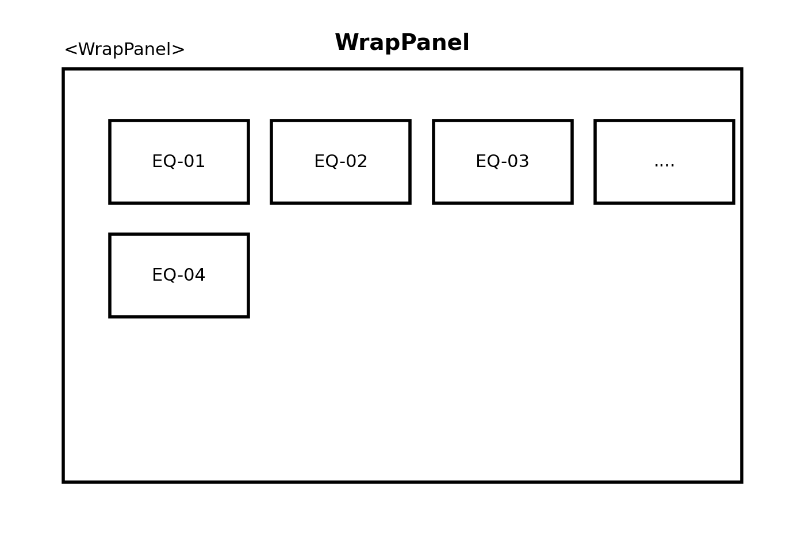

### `WPF`란?
- WPF는 **Windows 데스크톱 UI 프레임워크**이다.
- 화면은 **XAML(UI 선언)**, 동작은 **Code-behind(C# 이벤트/로직)** 로 나뉜다.
#### Visual Studio에서 프로젝트 만들기
1. Visual Studio 실행 → **Create a new project**
2. **WPF App (.NET) C#** 선택
### WPF 기본 구조
#### `MainWindow.xaml` (화면 UI)
- 버튼/텍스트/레이아웃을 **XAML 태그로 선언**하여 화면(UI)를 설계하는 파일이다.
-  `InitializeComponent()` XAML에 작성한 화면을 **실제로 생성해서 연결해주는 필수 코드**
#### `MainWindow.xaml.cs` (Code-behind)
- `MainWindow.xaml`에서 만든 UI에 대해 **동작(이벤트/로직)을** C#으로 구현하는 파일이다.
### Layout (Grid, StackPanel, DockPanel, WrapPanel)
#### `Grid` (화면의 기본 뼈대)
- `Grid`는 화면을 **행(Row)** 과 **열(Column)** 로 나눠서, 각 컨트롤을 몇 번째 칸에 배치하는 레이아웃이다.
- `Grid.RowDefinitions` : **행(Row)을** 정의하는 영역이다.
- `RowDefinition` : **행(Row)의 개수와 높이(크기)를** 설정한다.
```csharp
    <Grid>
        <Grid.RowDefinitions> //행 정의 영역
            <RowDefinition Height="60"/> 
            <RowDefinition Height="*"/> 
            <RowDefinition Height="180">
            </RowDefinition>
        </Grid.RowDefinitions>
        <Border Grid.Row="0" Background="red" />//Border는 테두리를 가진 컨테이너(박스)
        <Border Grid.Row="1" Background="Green" />  
        <Border Grid.Row="2" Background="Blue" />
    </Grid>
```

#### `Canvas` (좌표로 절대 위치 배치)
-  다른 패널(Grid/StackPanel)은 레이아웃 규칙으로 배치하지만, `Canvas`는 **내가 지정한 위치에 그대로 놓는 방식**이다.
- 자식 컨트롤을 **좌표(X,Y)** 로 직접 배치하는 패널이다.
- 창 크기가 바뀌어도 자동 재배치가 거의 안 돼서 **반응형 UI에는 약하다.**
- 배치 속성
    - `Canvas.Left="x"` / `Canvas.Top="y"` : 왼쪽/위 기준 좌표
    - `Canvas.Right` / `Canvas.Bottom` : 오른쪽/아래 기준 배치도 가능
    - `Panel.ZIndex` : 겹칠 때 앞/뒤 순서(값이 클수록 위)
```csharp
<Canvas Width="420" Height="240" Background="WhiteSmoke">

    <Border Canvas.Left="20" Canvas.Top="20"
            Width="120" Height="60"
            Background="LightBlue" BorderBrush="SteelBlue" BorderThickness="1">
        <TextBlock Text="EQ-01" VerticalAlignment="Center" HorizontalAlignment="Center"/>
    </Border>

    <Border Canvas.Left="180" Canvas.Top="40"
            Width="120" Height="60"
            Background="LightGreen" BorderBrush="SeaGreen" BorderThickness="1">
        <TextBlock Text="EQ-02" VerticalAlignment="Center" HorizontalAlignment="Center"/>
    </Border>

    <Border Canvas.Left="110" Canvas.Top="110"
            Width="160" Height="70"
            Background="MistyRose" BorderBrush="IndianRed" BorderThickness="1"
            Panel.ZIndex="10">
        <TextBlock Text="Alarm Overlay" VerticalAlignment="Center" HorizontalAlignment="Center"/>
    </Border>
</Canvas>
```


#### `StackPanel` (세로/가로로 쌓기)
- `StackPanel`은 안에 들어있는 컨트롤을 **한 방향으로 줄줄이 쌓아** 배치한다.
- 기본값은 `Vertical`
- `Orientation`은 쌓는 방향 옵션
###### `Horizontal` : 수평(왼쪽→오른쪽)
```csharp
<StackPanel Orientation="Horizontal">
    <Button Content="Start" Margin="4"/>
    <Button Content="Stop" Margin="4"/>
</StackPanel>
```

###### `Vertical` : 수직
```csharp
<StackPanel Orientation="Vertical">
    <Button Content="Start" Margin="4"/>
    <Button Content="Stop" Margin="4"/>
</StackPanel>
```

#### `DockPanel` (상/하/좌/우에 붙이기)
- 벽에 붙여 배치한다.
- 컨트롤을 **Top/Bottom/Left/Right** 중 하나에 붙여 놓을 수 있다.
- 마지막 남는 공간을 가운데가 차지하는 구조가 흔하다.
```csharp
<DockPanel>
    <Border DockPanel.Dock="Top" Height="50" Background="LightGray"/>
    <Border DockPanel.Dock="Left" Width="220" Background="WhiteSmoke"/>
    <Border Background="White"/> //남은 공간 전부 차지
</DockPanel>
```

#### `WrapPanel`
- 컨트롤을 **왼쪽→오른쪽으로 배치**하다가 공간이 부족하면 **자동으로 다음 줄로 내려**간다.
```csharp
<WrapPanel>
    <Button Content="EQ-01" Margin="4"/>
    <Button Content="EQ-02" Margin="4"/>
    <Button Content="EQ-03" Margin="4"/>
</WrapPanel>
```
