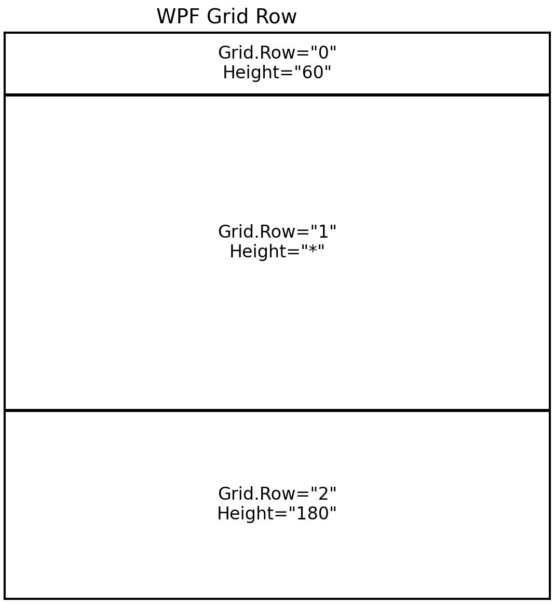

### `WPF`란?
- WPF는 **Windows 데스크톱 UI 프레임워크**이다.
- 화면은 **XAML(UI 선언)**, 동작은 **Code-behind(C# 이벤트/로직)**로 나뉜다.
#### Visual Studio에서 프로젝트 만들기
1. Visual Studio 실행 → **Create a new project**
2. **WPF App (.NET) C#** 선택
### WPF 기본 구조
#### `MainWindow.xaml` (화면 UI)
- 버튼/텍스트/레이아웃을 **XAML 태그로 선언**하여 화면(UI)를 설계하는 파일이다.
-  `InitializeComponent()` XAML에 작성한 화면을 **실제로 생성해서 연결해주는 필수 코드**
#### `MainWindow.xaml.cs` (Code-behind)
- `MainWindow.xaml`에서 만든 UI에 대해 **동작(이벤트/로직)을** C#으로 구현하는 파일이다.
### Layout (Grid, StackPanel, DockPanel, WrapPanel)
#### `Grid` (화면의 기본 뼈대)
- `Grid`는 화면을 **행(Row)** 과 **열(Column)** 로 나눠서, 각 컨트롤을 몇 번째 칸에 배치하는 레이아웃이다.
- `Grid.RowDefinitions` : **행(Row)을** 정의하는 영역이다.
- `RowDefinition` : **행(Row)의 개수와 높이(크기)를** 설정한다.
```csharp
    <Grid>
        <Grid.RowDefinitions> //행 정의 영역
            <RowDefinition Height="60"/> 
            <RowDefinition Height="*"/> 
            <RowDefinition Height="180">
            </RowDefinition>
        </Grid.RowDefinitions>
        <Border Grid.Row="0" Background="red" />//Border는 테두리를 가진 컨테이너(박스)
        <Border Grid.Row="1" Background="Green" />  
        <Border Grid.Row="2" Background="Blue" />
    </Grid>
```

#### `StackPanel` (세로/가로로 쌓기)