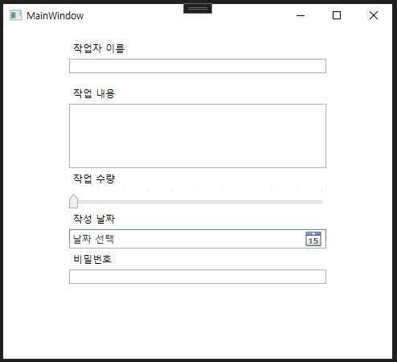
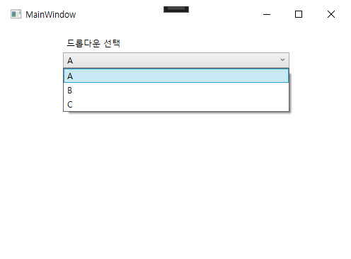
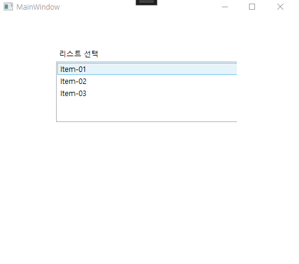
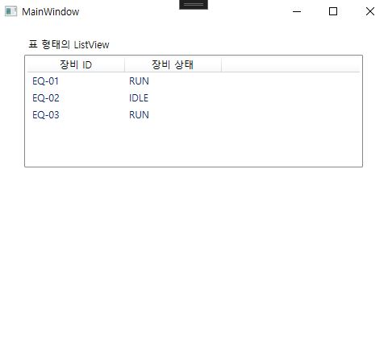
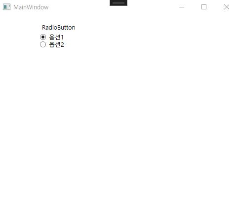
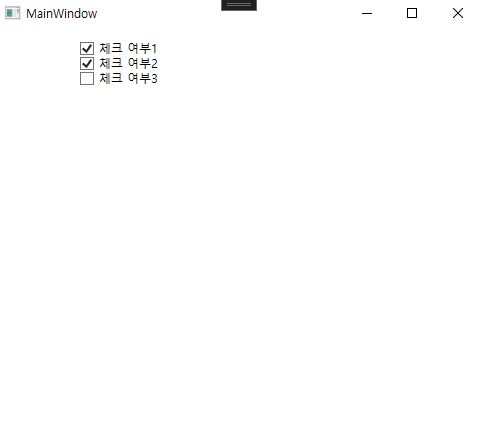
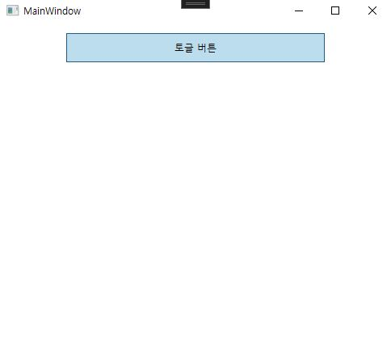
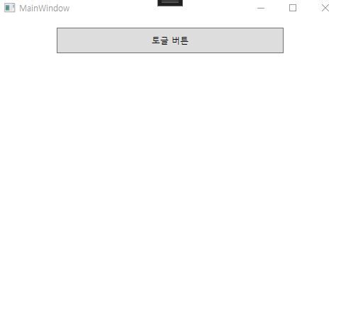

### `Control`
- WPF 화면에 올리는 **UI 요소**
- 사용자가 보고, 누르고, 입력하고, 선택하는 것들이 전부 컨트롤이다.
### `Control` 종류
### 입력
#### `TextBox`
- 사용자가 **문자열을 입력**하는 컨트롤이며, 입력 값은 `Text` 속성으로 쓸 수 있다.
- `AcceptsReturn="True"` : `Enter`로 줄바꿈 허용
- `TextWrapping="Wrap"` : 자동 줄바꿈
- `VerticalScrollBarVisibility="Auto"` : 내용이 `TextBox` 높이를 넘어갈 때 **자동으로 스크롤바 표시**
```csharp
<StackPanel x:Name="WorkLogInputPanel" Margin="12" Width="320">
    <Label Content="작업자 이름"/>
    <TextBox x:Name="WorkerName"/>
    <Label Content="작업 내용"  Margin="0,12,0,0"/>
    <TextBox x:Name="WorkLog"
             AcceptsReturn="True"
             Height="80"
             TextWrapping="Wrap"
         VerticalScrollBarVisibility="Auto"/>
</StackPanel>
```
##### `x:Name`
- **XAML**에서 만든 컨트롤에 식별자를 붙이는 것
- 해당 이름으로 C# 코드에서 **변수처럼 접근**할 수 있다.
- WPF에서 `x:Name`은 **PascalCase**로 많이 쓴다고 한다.
```csharp
<TextBox x:Name="WorkerName"/>
```
##### C# (code-behind)
- `Text` : 입력된 문자열
```csharp
string name = WorkerName.Text;
WorkerName.Text = "홍길동";
```
#### `Slider`
- 드래그하여 범위 값 입력
- `Minimum`, `Maximum` : 범위
- `TickFrequency`: **얼마 간격**으로 표시할지
- `TickPlacement`: 눈금 선 표시
- `IsSnapToTickEnabled` : 드래그할 때 값을 **가장 가까운 Tick 위치로 붙게 만드는 옵션**
```csharp
<Label Content="작업 수량"/>
<Slider x:Name="WorkSlider" 
		Minimum="0" Maximum="100" 
		TickFrequency="10"
		TickPlacement="BottomRight"
		IsSnapToTickEnabled="True"/>
```
##### C# (code-behind)
- `Value` : 현재 값(`Slider`의 값 타입은 기본이 `double`)
```csharp
double v = WorkSlider.Value;
```
#### `DatePicker`
- **날짜를 입력**하는 컨트롤
- 달력으로 선택할 수 있으며, 텍스트 입력도 가능하다.
```csharp
<Label Content="작성 날짜"/>
<DatePicker x:Name="DatePick"/>
```
##### C# (code-behind)
- `SelectedDate` : 선택된 날짜 (`DateTime?` → null 가능)
```csharp
DatePick.SelectedDate = DateTime.Today;
DateTime? d = DatePick.SelectedDate;
```
#### `PasswordBox` 
- `Password` : 입력된 비밀번호 문자열
```csharp
<Label Content="비밀번호"/>
<PasswordBox x:Name="WorkerPw"/>
```
##### C# (code-behind)
```csharp
string pw = WorkerPw.Password;
```

### 선택
#### `ComboBox` 
- 드롭다운 목록에서 항목을 하나 선택하는 컨트롤
- `SelectedIndex` : 기본 값으로 보여줄 인덱스
	- `0` = 첫 번째 (`A`)
	- `-1` = 선택 없음
```csharp
<StackPanel Margin="12" Width="320">
    <Label Content="드롭다운 선택"/>
    <ComboBox x:Name="MyCombo" SelectedIndex="0">
        <ComboBoxItem Content="A"/>
        <ComboBoxItem Content="B"/>
        <ComboBoxItem Content="C"/>
    </ComboBox>
</StackPanel>
```
##### C# (code-behind)
```csharp
int idx = MyCombo.SelectedIndex; // 선택된 항목의 인덱스

string item = (MyCombo.SelectedItem as ComboBoxItem)?.Content?.ToString();
// 선택된 항목(ComboBoxItem)의 Content("A","B","C")를 문자열로 가져오기
```

#### `ListBox` 
- 여러 항목이 세로로 나열된 목록에서 **선택**하는 컨트롤
- `SelectionMode` : 한 개만 선택할지, 여러 개 선택할지 결정
	- `Single` : **한 개만 선택** (기본값)
	- `Multiple` : **여러 개 선택 가능** (클릭할 때마다 선택 토글)
	- `Extended` : **Ctrl / Shift로 여러 개 선택**
```csharp
<StackPanel Margin="12" Width="320">
    <Label Content="리스트 선택"/>
    <ListBox x:Name="MyList" SelectionMode="Extended" Height="100">
        <ListBoxItem Content="Item-01"/>
        <ListBoxItem Content="Item-02"/>
        <ListBoxItem Content="Item-03"/>
    </ListBox>
</StackPanel>
```
##### C# (code-behind)
```csharp
// 하나만 선택했을 때 SelectionMode="Single"
string one = (MyList.SelectedItem as ListBoxItem)?.Content?.ToString();

// 여러 개 선택했을 때 
var selectedTexts = new List<string>();
foreach (ListBoxItem it in MyList.SelectedItems)
{
    selectedTexts.Add(it.Content?.ToString());
}
```

#### `ListView` 
- 여러 데이터를 **목록 형태로 보여주는 컨트롤**
- `View`에 `GridView`를 넣으면 **표(Table)** 처럼 컬럼을 구성할 수 있다.
- `DisplayMemberBinding="{Binding 프로퍼티명}"` 표시할 프로퍼티를 연결
```csharp
    <StackPanel Margin="12" Width="420">
        <Label Content="표 형태의 ListView"/>
        <ListView x:Name="MyView" Height="140" >
            <ListView.View>
                <GridView>
                    <GridViewColumn Header="장비 ID" DisplayMemberBinding="{Binding EquipmentId}" Width="120"/>
                    <GridViewColumn Header="장비 상태" DisplayMemberBinding="{Binding EquipmentState}" Width="120"/>
                </GridView>
            </ListView.View>
        </ListView>
    </StackPanel>
```
##### C# (code-behind)
- `ItemsSource` : `ListView`에 보여줄 데이터 목록을 연결한다.
```csharp
public class EquipmentRow
{
    public string EquipmentId { get; set; }
    public string EquipmentState { get; set; }
}
public MainWindow()
{
    InitializeComponent();

    MyView.ItemsSource = new List<EquipmentRow>
    {
        new EquipmentRow { EquipmentId = "EQ-01", EquipmentState = "RUN" },
        new EquipmentRow { EquipmentId = "EQ-02", EquipmentState = "IDLE" },
        new EquipmentRow { EquipmentId = "EQ-03", EquipmentState = "RUN" },
    };
}
```

#### `RadioButton` 
- **여러 옵션 중 1개만 선택**하게 만드는 컨트롤
- 같은 그룹으로 묶으려면 `GroupName`을 동일하게 하면 된다.
  (같은 그룹에 속해 있으면 한 번에 하나만 선택됨)
```csharp
<StackPanel Margin="12" Width="320">
    <Label Content="RadioButton"/>
    <RadioButton x:Name="R1" Content="옵션1" GroupName="G" IsChecked="True"/>
    <RadioButton x:Name="R2" Content="옵션2" GroupName="G"/>
</StackPanel>
```
##### C# (code-behind)
- `IsChecked`로 선택 여부를 확인한다.
```csharp
bool is1 = (R1.IsChecked == true);
```

#### `CheckBox` 
- **독립적으로 선택**하는 컨트롤  
- 여러 개 체크박스가 있으면 **여러 개를 동시에 선택**할 수도 있다.
```csharp
    <StackPanel Margin="12" Width="320">
        <CheckBox x:Name="Ck1" Content="체크 여부1"/>
        <CheckBox x:Name="Ck2" Content="체크 여부2"/>
        <CheckBox x:Name="Ck3" Content="체크 여부3"/>
    </StackPanel>
```
##### C# (code-behind)
- `IsChecked`로 **체크 상태**를 확인한다.
- `IsChecked` 타입은 `bool`(`nullable` 가능) `true/false/null`
```csharp
bool on = (Ck1.IsChecked == true);
```

#### `ToggleButton` 
- **버튼처럼 클릭**하지만, 클릭할 때마다 **상태가 ON/OFF로 유지되는(토글되는) 컨트롤**
- `Button`은 클릭하면 끝(순간 동작)이지만, `ToggleButton`은 **현재 상태를 기억**한다.
```csharp
<StackPanel Margin="12" Width="320">
    <ToggleButton x:Name="Tg" Content="토글 버튼" Height="36"/>
</StackPanel>
```
##### C# (code-behind)
- `IsChecked`로 **현재 상태**를 확인한다.
```csharp
bool isOn = (Tg.IsChecked == true);
```
<p>
  
  
</p>