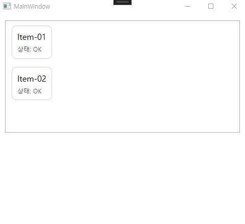
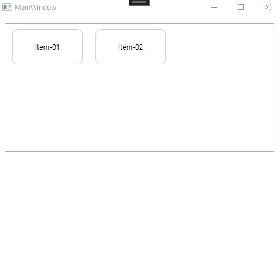
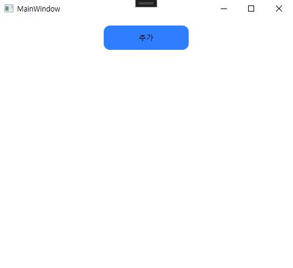

## `Template`
- WPF에서 **어떻게 보일지/어떻게 배치될지** 를 **XAML로 교체/정의**하는 기능이다.
- 코드로 UI를 매번 만들지 않고, **데이터/컨트롤의 표현 방식을 `Template`로 분리**해서 재사용한다.
- 대표 3종류
    - **DataTemplate**: 데이터(객체) 1개를 어떻게 그릴까?
    - **ItemsPanelTemplate**: 아이템들을 어떤 패널로 배치할까?
    - **ControlTemplate**: 컨트롤 자체(버튼/체크박스 등)의 모양을 통째로 바꿀까?
### `DataTemplate`
- `ItemsControl`(`ListBox`/`ListView`/`DataGrid` 등)이 `ItemsSource`로 데이터를 받을 때,  
  **각 아이템(데이터 1개)을 화면에 어떻게 표시할지**정의한다.
- **카드 한 장 디자인**으로 이해하면 쉽다.
```csharp
<Window x:Class="WpfApp1.MainWindow"
        xmlns="http://schemas.microsoft.com/winfx/2006/xaml/presentation"
        xmlns:x="http://schemas.microsoft.com/winfx/2006/xaml"
        Title="Templates" Height="380" Width="520">

    <Window.DataContext>
        <local:MainViewModel/>
    </Window.DataContext>

    <StackPanel Margin="12">
        <ListBox ItemsSource="{Binding Items}" Height="220">
            <ListBox.ItemTemplate>
	            <!-- DataTemplate: Items 안의 "각 데이터 1개"를 이렇게 그려라 -->
                <DataTemplate>
                    <Border Margin="6" Padding="10"
                            BorderBrush="LightGray" BorderThickness="1"
                            CornerRadius="8">
                        <StackPanel>
                            <TextBlock Text="{Binding}" FontSize="16"/>
                            <TextBlock Text="상태: OK" Opacity="0.7" Margin="0,6,0,0"/>
                        </StackPanel>
                    </Border>
                </DataTemplate>
            </ListBox.ItemTemplate>
        </ListBox>
    </StackPanel>
</Window>
```

### `ItemsPanelTemplate`
- `ItemsControl`이 아이템들을 **어떤 레이아웃 패널에 담아서 배치할지** 결정한다.
- **카드를 책상에 늘어놓는 방식**으로 이해하면 쉽다.
- 기본은 `StackPanel`이다.
- 세로로 쌓기: `<VirtualizingStackPanel />` 
- 줄바꿈 타일: `<WrapPanel />`
- 격자 타일: `<UniformGrid Columns="3" />`
- 가로로 나열: `<StackPanel Orientation="Horizontal" />`
```csharp
<ListBox ItemsSource="{Binding Items}" Height="220" ScrollViewer.HorizontalScrollBarVisibility="Disabled">
    
    <ListBox.ItemsPanel>
        <ItemsPanelTemplate>
            <WrapPanel /> <!-- 이 자리에 원하는 패널을 입력한다-->
        </ItemsPanelTemplate>
    </ListBox.ItemsPanel>
    <ListBox.ItemTemplate>
        <DataTemplate>
            <Border Margin="6" Padding="10"
                    Width="120" Height="60"
                    BorderBrush="LightGray" BorderThickness="1"
                    CornerRadius="8">
                <TextBlock Text="{Binding}" VerticalAlignment="Center" HorizontalAlignment="Center"/>
            </Border>
        </DataTemplate>
    </ListBox.ItemTemplate>
</ListBox>
```
##### 기존`StackPanel`에서 `WrapPanel`로 변환된 모습

### `ControlTemplate` 
- `Button`, `TextBox` 같은 **컨트롤의 외형/구성을 통째로 재정의**한다.
```csharp
<Button Content="추가" Width="140" Height="40" Margin="0,0,0,10">
    <Button.Template>
        <ControlTemplate TargetType="Button">
            <Border Background="#2D7DFF" CornerRadius="10" Padding="10">
                <!-- ContentPresenter = Button.Content를 표시해주는 자리 -->
                <ContentPresenter HorizontalAlignment="Center" VerticalAlignment="Center"/>
            </Border>
        </ControlTemplate>
    </Button.Template>
</Button>

```
