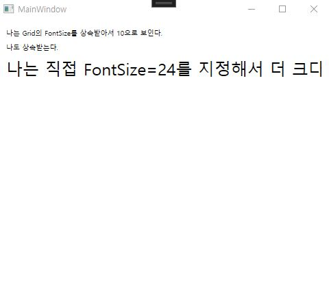
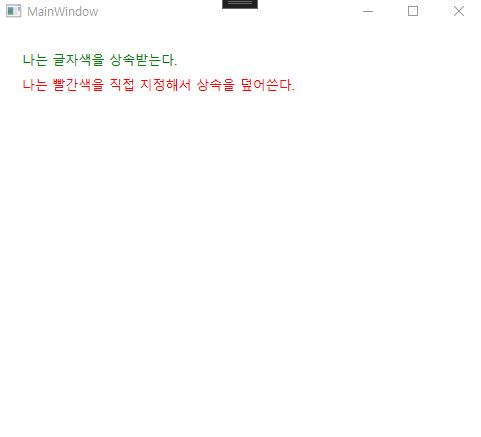

### WPF 값 상속(Property Value Inheritance)
- WPF에는 **DependencyProperty(의존 속성)** 라는 시스템이 있다,
- 그 중 일부 속성은 **부모(컨테이너)에 설정한 값이 자식 컨트롤로 상속** 된다.
- 부모 `Grid`나 `StackPanel`에 `FontSize`, `FontFamily` 같은 값을 주면, 안쪽 `TextBlock`, `Button` 같은 자식들도 **따로 지정하지 않아도 같은 값이 적용**된다.
- 이 동작을 **값 상속(Value Inheritance)** 이라 부른다.
#### 값 상속이 적용되는 대표 속성
- `FontFamily`, `FontSize`, `FontWeight`, `Foreground`
- `FlowDirection`(`LeftToRight`/`RightToLeft`)
- `Language` 등
- 모든 속성이 상속되는 건 아니고, **상속 가능하도록 설계된 일부 속성만** 상속된다.
##### XAML
- 첫 번째/두 번째 `TextBlock`은 **Grid의 FontSize를 상속**받아 160로 보인다.
- 세 번째 `TextBlock`은 `FontSize="24"`를 직접 줬기 때문에 **상속값(10)보다 우선**한다.
```csharp
<Grid Margin="12" TextElement.FontSize="10">
    <StackPanel>
        <!-- FontSize를 따로 안 줬지만, Grid의 FontSize=10을 상속받음 -->
        <TextBlock Text="나는 Grid의 FontSize를 상속받아서 10으로 보인다."/>
        <TextBlock Text="나도 상속받는다." Margin="0,8,0,0"/>

        <!-- 자식이 직접 FontSize를 지정하면 그 값이 우선(상속보다 우선) -->
        <TextBlock Text="나는 직접 FontSize=24를 지정해서 더 크다."
               FontSize="24" Margin="0,8,0,0"/>
    </StackPanel>
</Grid>
```

##### XAML
- 부모에 `Foreground`를 주면 자식들도 글자색이 바뀐다
```csharp
<Grid Margin="12" TextElement.FontSize="13">
    <StackPanel Margin="12" TextElement.Foreground="green">
        <!-- Foreground를 상속받아 글자색이 DarkBlue -->
        <TextBlock  Text="나는 글자색을 상속받는다."/>
        <!-- 자식에서 Foreground를 직접 지정하면 그 값이 우선 -->
        <TextBlock Text="나는 빨간색을 직접 지정해서 상속을 덮어쓴다."
           Foreground="Red" Margin="0,8,0,0"/>
    </StackPanel>
```
