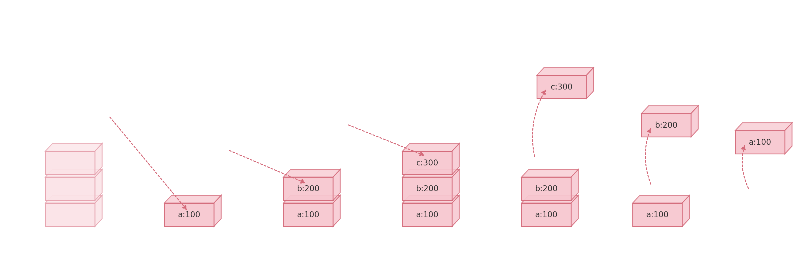
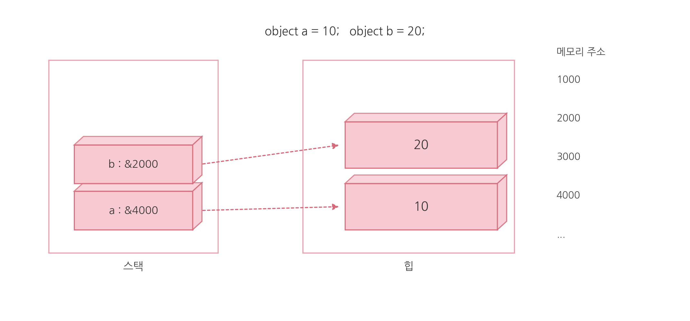
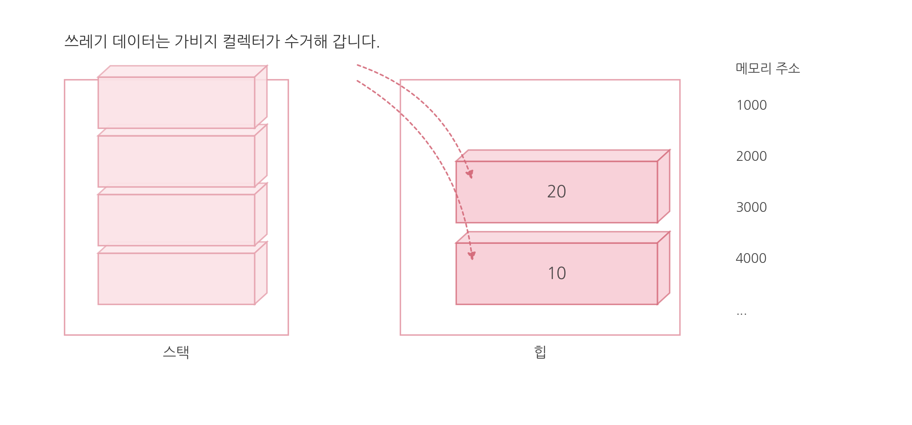

## `Stack`, `Heap` 
> 프로그램이 실행되면, 필요한 데이터는 모두 **메모리(RAM)** 어딘가에 저장된다.  
> 그 메모리는 크게 **스택(Stack)** 과 **힙(Heap)** 이라는 두 공간을 중심으로 관리된다.  

### `Stack`
스택(Stack)은 **메서드 실행 중 필요한 지역 변수, 매개 변수, 참조 값들이 놓이는 메모리 공간**이다. 
아래 코드가 실행되면 `a`, `b`, `c` 같은 **지역 변수**가 스택에 **차례대로 쌓이는 형태**로 배치된다.  
코드 블록이 끝나면 해당 스택 프레임이 정리되면서, 이 변수들은 **스택에서 걷혀 나간다.** 

```csharp
{
    int a = 100;
    int b = 200;
    int c = 300;
} 
```

### `Heap` 
`new`로 만든 **객체의 실체(데이터)** 가 놓이는 메모리 공간이다.
힙은 저장된 데이터를 스스로 제거하는 메커니즘을 갖고있지않고 가바지컬렉터라는 프로그램 뒤에 숨어 동작하면서 힙에 더이상 사용하지 않은 (참조되지 않은) 객체가 있으면 그 객체를 수거하는 기능을 한다.  참조 형식의 변수는 힙과 스택을 함께 사용하는데 힙 영역에서는 데이터를 저장하고 스택 영역에는 저장된 힙 메모리의 주소를 저장한다. 
```csharp
{
	object a = 10;
	object b = 20;
}
```


스택에 저장된 데이터는 코드 블록이 끝나는 시점에 걷혀나기기 때문에 a와 b는 스택에서 사라진다. 힙에는 여전히 10과 20이 남아있다.
이 데이터들은 가비지 컬렉터가 수거해간다.

**예제 코드**
```csharp
void Foo()
{
    int x = 10;             // 값형
    Person p = new Person(); // 참조형 변수 + 객체 생성
    p.Age = 20;
} // Foo 끝나면 스택 프레임이 사라짐
```
#### 메서드 실행 중 메모리 모습
- `int x`는 **값 자체**가 스택에 들어간다.
- `Person p`는 **참조값이 스택에 들어가고, `new Person()`으로 만든 객체 실체**는 힙에 들어간다.
```csharp
[ Stack ]  (Foo의 스택 프레임)
+----------------------+
| x = 10               |  <-- 값 자체가 스택에 저장
| p = 0xA13F...        |  <-- "참조값만 스택에 저장
+----------------------+

[ Heap ]  (GC가 관리하는 영역)
+----------------------+
| Person 객체(실체)     |
| Age = 20             |
| ...                  |
+----------------------+
```

