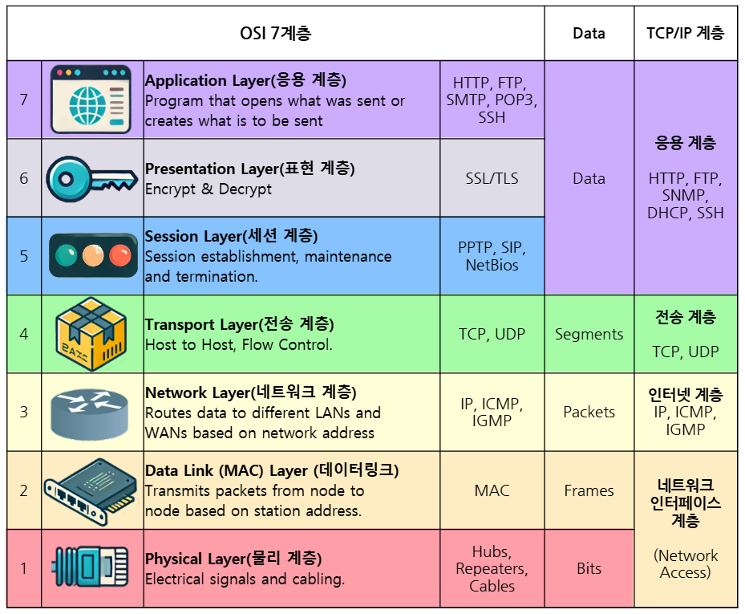
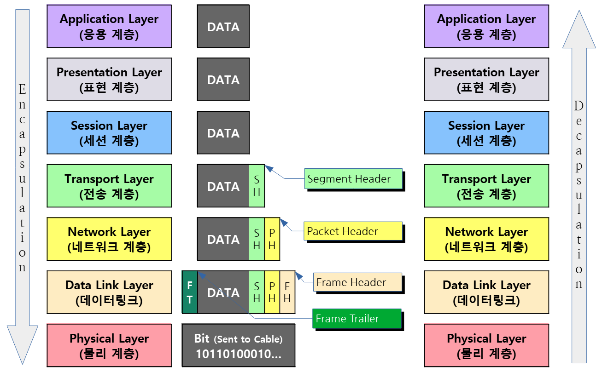

### OSI 7 계층
- 네트워크에서 통신이 일어나는 과정을 7단계로 나눈 것을 말한다.
- 한 계층의 변화가 다른 계층에 영향을 최소화하도록 설계되었다.

#### 7. 응용 계층
- 사용자가 직접 사용하는 애플리케이션 프로토콜
- 사용자의 데이터와 직접 상호 작용하는 유일한 계층
- HTTP, FTP, SSH, DNS 등이 포함된다.
#### 6. 표현 계층
- 데이터 암호화, 압축, 인코딩/디코딩 수행
- openssl – 암호화 및 인증서 확인
#### 5. 세션 계층
- 세션 설정, 유지 및 종료
- RPC, NetBIOS, SIP 등
- `rpcinfo` – RPC 서비스 확인

> 현재 실행 중인 RPC 기반 서비스를 확인한다.

- `telnet` – 원격 세션 테스트

```bash
sudo dnf install -y telnet
telnet 192.168.0.100 23
```

- `who` – 현재 로그인한 사용자 확인

```bash
who
```

#### 4. 전송 계층
- 데이터 패킷이 손실이나 오류 없이 올바른 순서로 도착하고, 필요 시 재전송을 통해 복구하는 것에 중점
- TCP/UDP 기반의 데이터 전송
- 포트 번호 기반의 통신 관리
- `ss` – 소켓 상태 확인

```bash
ss -tulnp
```

- `nc` – 포트 테스트

```bash
sudo dnf install -y nc
nc -zv 192.168.1.1 22
```

#### 3. 네트워크 계층
- IP 주소를 사용하여 다른 네트워크 간의 통신을 관리한다.
- 패킷을 목적지까지 전달하는 역할을 담당
- 라우터를 통해 패킷을 목적지까지 전달
- 인터넷 프로토콜인 IPv4와 IPv6가 주로 네트워크 계층 프로토콜로 사용된다.
- ip route – 라우팅 테이블 확인 및 설정

```bash
ip route
```

- `ping` – 네트워크 연결 상태 확인

```bash
ping 8.8.8.8
```

- `tracepath` – 패킷이 목적지까지 가는 경로 추적 (ICMP 기반)

```bash
tracepath 8.8.8.8
```

#### 2. 데이터 링크 계층
- MAC 주소 기반의 통신
- 스위치와 LAN 내 장치 간의 데이터 프레임 전송 담당
- ARP(Address Resolution Protocol) 사용하여 IP → MAC 주소 변환
- 데이터 링크 계층에서의 연결은 광범위한 인터넷 연결이 아닌, 인접한 장치 간의 통신
- ARP 테이블 확인
```bash
ip neigh show
```

- MAC Address 확인
```bash
ip link show
```
#### 1. 물리 계층
- 물리 계층에서는 전기적, 기계적, 물리적 특성에 집중
- 물리적인 매체(케이블, 허브 등)를 통해 비트를 전송하는 역할
- 네트워크 인터페이스 카드(NIC), 케이블, 무선 신호 등을 포함
- ethtool – 네트워크 인터페이스의 물리적 속성 확인
### Encapsulation & Decapsulation
- 네트워크 통신에서 Encapsulation (캡슐화)와 Decapsulation (디캡슐화)는 데이터가 전송될 때 계층별로 처리되는 방식을 설명하는 개념이다.
#### Encapsulation (캡슐화)
- 데이터를 송신할 때, 상위 계층에서 하위 계층으로 내려가며 각 계층별로 헤더를 추가하는 과정이다.
- 각 계층에서 필요한 제어 정보를 추가하여 데이터 패킷을 완성하는 역할을 수행한다.
#### Decapsulation (디캡슐화)
- 데이터를 수신할 때는 반대로 각 계층에서 헤더와 트레일러를 제거하는 과정이다.
- Encapsulation의 반대 과정으로, 원래의 데이터를 복원하는 역할을 수행한다.
#### 흐름

| 단계           | 송신 측 (Encapsulation: 캡슐화)  | 수신 측 (Decapsulation: 디캡슐화) |
| ------------ | -------------------------- | -------------------------- |
| 7. 응용 계층     | HTTP 데이터 생성                | 웹 브라우저에서 HTTP 데이터 해석       |
| 6. 표현 계층     | 데이터 암호화/압축 (SSL/TLS 적용 가능) | 데이터 복호화/압축 해제              |
| 5. 세션 계층     | 세션 연결 설정 (예: TCP 소켓 생성)    | 세션 해제 또는 유지                |
| 4. 전송 계층     | TCP/UDP 헤더 추가 (세그먼트 생성)    | TCP/UDP 헤더 제거              |
| 3. 네트워크 계층   | IP 헤더 추가 (패킷 생성)           | IP 헤더 제거                   |
| 2. 데이터 링크 계층 | MAC 헤더 및 트레일러 추가 (프레임 생성)  | MAC 헤더 및 트레일러 제거           |
| 1. 물리 계층     | 신호(비트)로 변환 후 네트워크 전송       | 비트를 데이터로 변환                |
#### 흐름 도식

