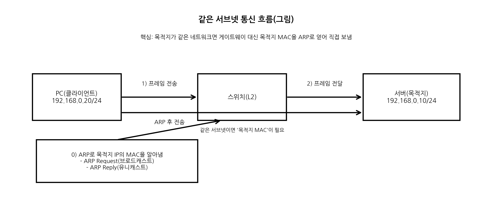
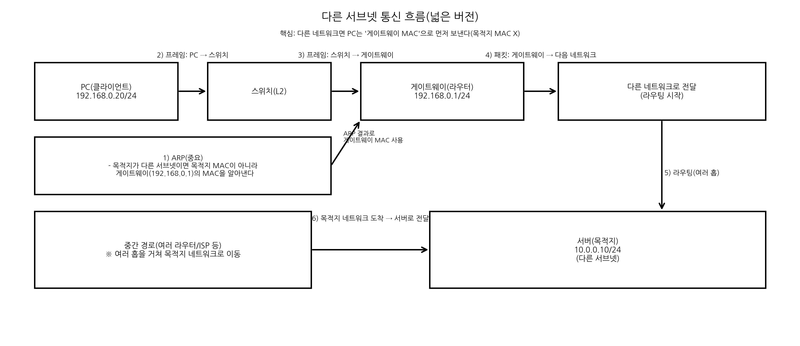

### TCP/IP란?
- TCP/IP는 인터넷 통신에서 사용하는 **프로토콜 스택(계층 구조)**이다.
- IP가 어디로 보낼지(주소/라우팅)를 담당하고, TCP가 어떻게 보낼지(연결/신뢰성)를 담당한다.
- 실제 통신은 `IP + (TCP/UDP) + 응용프로토콜(HTTP 등)`의 조합으로 동작한다.
### TCP/IP 4계층
1. **Application(응용)**
    - 애플리케이션이 사용하는 통신 규칙(HTTP, DNS, SSH 등)
2. **Transport(전송)**
    - 프로세스 간 통신, 포트 기반 식별, 전송 방식(TCP 등)
3. **Internet(인터넷)**
    - IP 주소 기반의 패킷 전달과 라우팅(IPv4/IPv6)
4. **Link(링크)**
    - 같은 네트워크 구간에서 프레임 전달(Ethernet/Wi-Fi), ARP 등
### TCP
- TCP(Transmission Control Protocol)는 **연결 지향** 전송 프로토콜이다.
- 통신 전에 연결을 만들고(3-way handshake), 데이터 전송 중에는 신뢰성과 순서를 보장한다.
#### TCP가 제공하는 것
- **신뢰성**: 손실 시 재전송
- **순서 보장**: 순서가 바뀌면 재정렬
- **흐름 제어**: 수신자가 처리 가능한 속도에 맞춰 조절
- **혼잡 제어**: 네트워크 혼잡을 고려해 송신량 조절
### IP
- IP(Internet Protocol)는 **IP 주소**를 사용해 데이터를 목적지까지 전달하는 프로토콜이다.
- 데이터는 **패킷**단위로 전달되며, 라우터를 통해 여러 네트워크를 거쳐 목적지로 이동할 수 있다.
- IP는 신뢰성, 순서 등을 보장하지 않기 때문에 **TCP**같은 전송 계층을 통해 이런 부분을 보완한다.
### 포트(Port)
- 포트는 **같은 IP(컴퓨터) 안에서 어떤 프로그램과 통신할지**를 구분하는 번호다.
- ex) `192.168.0.10:80` 
### 서브넷 마스크
- 서브넷 마스크는 IP 주소 중에서 **네트워크 부분**과 **호스트 부분**을 나누는 기준이다.
- IP와 서브넷 마스크를 이용해 목적지가 같은 서브넷인지를 판단한다.
- 같은 서브넷이면 직접 통신(ARP), 다른 서브넷이면 게이트웨이로 전달한다.
#### CIDR
- `/24` ↔ `255.255.255.0` → 같은 네트워크: `A.B.C.x` (ex: `192.168.0.x`)
- `/16` ↔ `255.255.0.0` → 같은 네트워크: `A.B.x.x` (ex: `192.168.x.x`)
- `/8` ↔ `255.0.0.0` → 같은 네트워크: `A.x.x.x` (ex: `192.x.x.x`)
**예시로 이해하기**
`192.168.0.20/24` (서브넷 마스크: `255.255.255.0`)
- 네트워크 주소(Network): `192.168.0.0`
- 호스트 ID(Host): `0.0.0.20` (마지막 옥텟 = 20)
- 같은 네트워크 범위: `192.168.0.0 ~ 192.168.0.255`
### 게이트웨이
- 다른 네트워크(다른 서브넷)로 나갈 때 거치는 출구(라우터)다.
- 목적지 IP가 내 서브넷 밖이면, 패킷을 게이트웨이로 보내고 라우터가 다음 경로로 전달한다.
### TCP/IP 동작 흐름 순서

