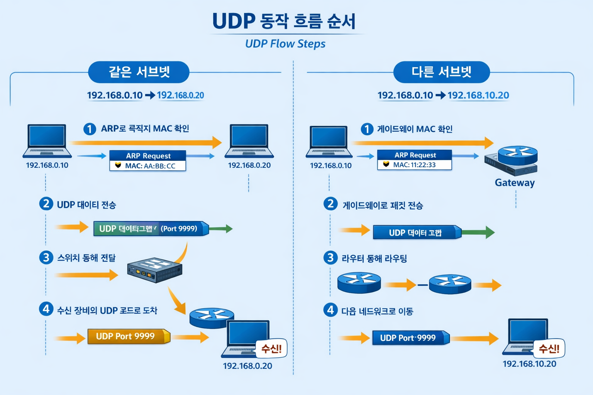

### UDP란?  
- UDP(User Datagram Protocol)는 전송 계층(L4)에서 동작하는 **비연결형 전송 프로토콜**이다.  
- TCP처럼 연결(3-way handshake)을 만들지 않고, 데이터를 **데이터그램(datagram)단위로 전송**한다.  
- 확실하게보다 **빠르고 가볍게**에 초점이 있다.
#### UDP 특징
- **신뢰성 보장 없음**: 유실돼도 재전송을 하지 않는다.
- **순서 보장 없음**: 순서가 바뀔 수 있다.
- **흐름/혼잡 제어 없음**: 네트워크가 혼잡해져도 UDP 자체는 조절 기능이 약하다.
- **헤더가 단순**하고 처리가 빠르다.
- **체크섬(Checksum)** 으로 데이터가 깨졌는지는 감지할 수 있지만, **유실된 데이터를 다시 보내주진 않는다.**
#### UDP를 쓰는 이유 
- **연결 생성/유지 과정이 없어** 지연이 적고 오버헤드가 작다.
- 한 번에 여러 대상에게 뿌리는 **브로드캐스트/멀티캐스트**에 유리하다.
- 조금 **유실돼도 괜찮은 데이터**라면 TCP보다 효율적일 수 있다.
#### UDP가 사용되는 대표 사례
- - DNS
- 스트리밍/실시간 게임/VoIP 등 지연이 더 중요한 통신
- 브로드캐스트/멀티캐스트 기반 장비 탐색
- 로그/텔레메트리처럼 약간 누락되어도 전체 흐름엔 큰 문제 없는 데이터

#### UDP와 TCP 차이
- **TCP** : 연결 지향 + 신뢰성(재전송/순서 보장)
- **UDP** : 비연결 + 빠름/가벼움(신뢰성은 앱이 필요하면 직접 처리)
### MES에서 사용되는 UDP
현장 장비 통신은 TCP 기반이 많은 편이지만, MES/현장 네트워크에서 UDP를 사용하는 경우는 보통 아래 패턴이다.
#### **실시간 데이터 수집**
- PLC가 생산 라인의 상태(온도, 압력, 카운터 등)를 MES 서버로 빠르게 전송할 때 UDP를 사용할 수 있다.
#### 단순 이벤트 전송
- 특정 이벤트 발생 시(예: 알람 발생) 신속하게 상위 시스템에 알리는 용도로 사용한다.
- 장비가 1초마다 상태를 송신(ON/OFF, 온도, 속도 등) → MES/HMI가 수신해서 표시  
### UDP 동작 흐름 순서
