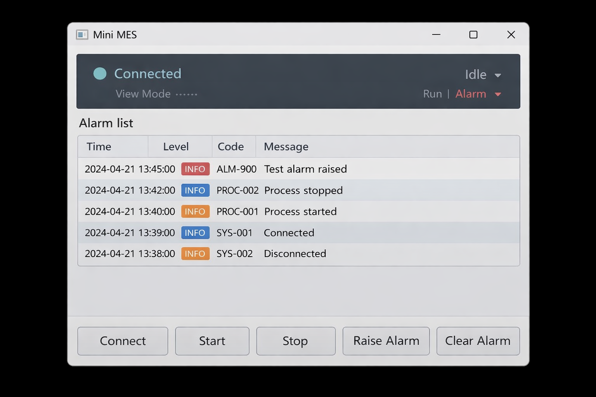

앞으로 다룰 UI/Scenario 파트의 효율성을 높이기 위해 본격적인 프로젝트 투입에 앞서 MVVM 구조를 빌드하는 연습을 진행했다. 목표는 **코드비하인드 최소화**와 상태, 이벤트 중심의 유연한 화면 구성이다.
## Model (C#)
- 현실 데이터/도메인 담당
- 예: `MachineStatus`, `AlarmItem`
- UI(WPF) 타입(Visibility, Brush) 넣지 않기
## ViewModel (C#)
- 화면이 필요로 하는 데이터 + 행동(명령) 담당
- Properties: `IsConnected`, `MachineStateText`, `Alarms`
- Commands: `ConnectCommand`, `StartCommand`
## View (XAML)
- UI 담당
- 버튼, 텍스트, 리스트 배치
- **비즈니스 로직 넣지 않기**

### MES 화면

**화면 구성**
- 상단: 설비 연결상태(Connected / Disconnected), 현재 상태(Idle/Run/Alarm)
- 가운데: 알람 리스트 (최근 알람 10개)
- 하단 버튼: `Connect`, `Start`, `Stop`, `Raise Alarm`, `Clear Alarm`

**목표**
- **code-behind**가 아닌 **Command**로 동작하도록 구성
- 상태,리스트 자동으로 갱신 (**Binding + INotifyPropertyChanged + ObservableCollection**)

**예시 화면**



#### Views/MainWindow.xaml
```csharp
<Window x:Class="MES_APP.Views.MainWindow"
        xmlns="http://schemas.microsoft.com/winfx/2006/xaml/presentation"
        xmlns:x="http://schemas.microsoft.com/winfx/2006/xaml"
        Title="Mini MES" Height="520" Width="760"
        WindowStartupLocation="CenterScreen">

    <Grid Margin="16">
        <Grid.RowDefinitions>
            <RowDefinition Height="Auto"/>
            <RowDefinition Height="12"/>
            <RowDefinition Height="*"/>
            <RowDefinition Height="12"/>
            <RowDefinition Height="Auto"/>
        </Grid.RowDefinitions>

        <!-- 상태 영역 -->
        <Border Grid.Row="0" Padding="12" CornerRadius="8" Background="#1F1F1F">
            <Grid>
                <Grid.ColumnDefinitions>
                    <ColumnDefinition Width="*"/>
                    <ColumnDefinition Width="*"/>
                </Grid.ColumnDefinitions>

                <StackPanel Grid.Column="0">
                    <TextBlock Text="Equipment Status" Foreground="White" FontSize="16" FontWeight="SemiBold"/>
                    <StackPanel Orientation="Horizontal" Margin="0,10,0,0">
                        <TextBlock Text="Connection: " Foreground="White" Opacity="0.8"/>
                        <TextBlock Text="Connected" Foreground="White" FontWeight="SemiBold"/>
                    </StackPanel>
                </StackPanel>

                <StackPanel Grid.Column="1" HorizontalAlignment="Right">
                    <TextBlock Text="State" Foreground="White" Opacity="0.8" HorizontalAlignment="Right"/>
                    <TextBlock Text="Idle" Foreground="White" FontSize="18" FontWeight="SemiBold" HorizontalAlignment="Right"/>
                </StackPanel>
            </Grid>
        </Border>

        <!-- 알람 영역 -->
        <Border Grid.Row="2" Padding="12" CornerRadius="8" Background="#F4F4F4">
            <DockPanel>
                <TextBlock DockPanel.Dock="Top"
                           Text="Alarms (latest 10)"
                           FontSize="14"
                           FontWeight="SemiBold"
                           Margin="0,0,0,8"/>

                <DataGrid AutoGenerateColumns="False"
                          CanUserAddRows="False"
                          IsReadOnly="True">
                    <DataGrid.Columns>
                        <DataGridTextColumn Header="Time" Width="160" Binding="{Binding Time}" />
                        <DataGridTextColumn Header="Level" Width="80" Binding="{Binding Level}" />
                        <DataGridTextColumn Header="Code" Width="100" Binding="{Binding Code}" />
                        <DataGridTextColumn Header="Message" Width="*" Binding="{Binding Message}" />
                    </DataGrid.Columns>
                </DataGrid>
            </DockPanel>
        </Border>

        <!-- 버튼 영역 -->
        <StackPanel Grid.Row="4" Orientation="Horizontal" HorizontalAlignment="Right">
            <Button Content="Connect" Margin="0,0,8,0" Padding="14,8"/>
            <Button Content="Start" Margin="0,0,8,0" Padding="14,8"/>
            <Button Content="Stop" Margin="0,0,8,0" Padding="14,8"/>
            <Button Content="Raise Alarm" Margin="0,0,8,0" Padding="14,8"/>
            <Button Content="Clear Alarm" Padding="14,8"/>
        </StackPanel>
    </Grid>
</Window>
```

```csharp
<DataGrid AutoGenerateColumns="False"
          CanUserAddRows="False"
          IsReadOnly="True">
```
- **AutoGenerateColumns="False"**  
    → `DataGrid.Columns`에 정의한 컬럼만 화면에 나온다. 
    (`Time`, `Level`, `Code`, `Message`처럼 이 화면에서 보여줄 열을 고정)
- **CanUserAddRows="False"**  
    → 사용자가 UI에서 새 행을 추가하는 기능을 비활성화한다.
- **IsReadOnly="True"**  
    → 읽기 전용으로 설정하여 셀 편집을 차단한다. 사용자는 데이터를 조회만 할 수 있다.