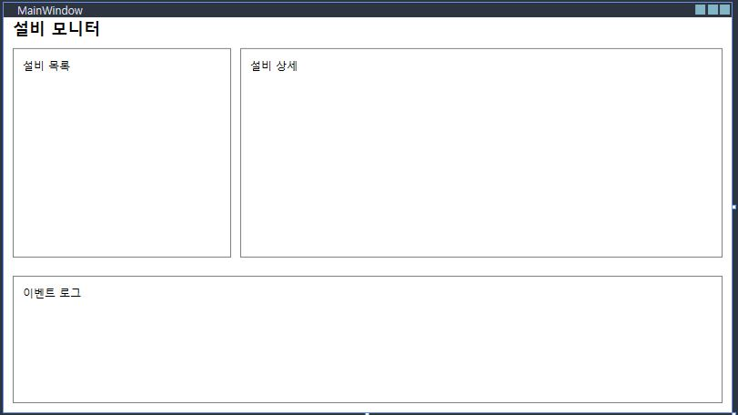
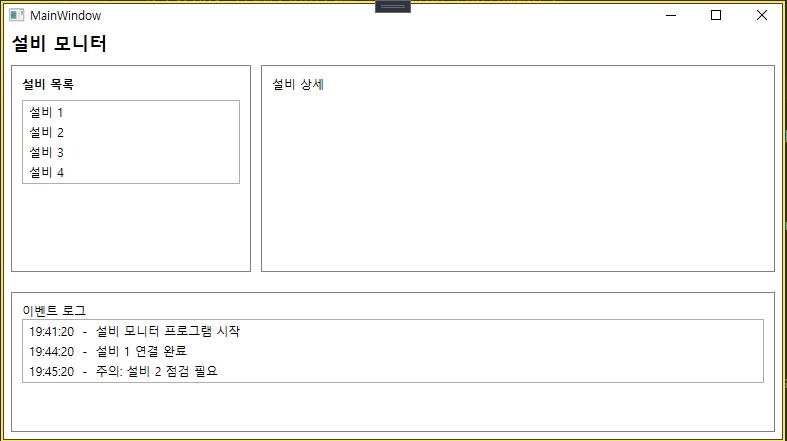

앞으로 담당하게 될 UI/Scenario 파트에 빠르게 적응하기 위해, OJT 기간동안 WPF MVVM 구조와 DevExpress를 연습하려고 한다. DevExpress를 안정적으로 활용하기 위해서 WPF의 기본 틀을 먼저 이해하고 DevExpress를 확장하는 방식으로 학습 방향을 정했다.

### `DevExpress`
DevExpress는 **WPF에서 사용하는 컴포넌트(그리드, 트리, 차트 등)** 를 고급 기능까지 포함해서 제공하는 **상용 UI 라이브러리**다. 
기본 WPF 컨트롤로도 구현은 가능하지만, DevExpress를 쓰면 **기능을 더 빠르고 안정적으로** 구성할 수 있다고 한다. <br>
~~무료 기간동안 알차게 공부 해야함.. 떨린다~~

---
### Mini MES

**화면 구성, 기능**
- 좌측: 설비 목록
  설비(설비 1~4)를 리스트로 표시하고, 선택한 설비를 현재 대상으로 설정
- 우측: 설비 상세
  연결 상태(연결, 해제)
  가동 모드(가동, 대기)
  마지막 확인(예: 2분 전)
- 우측 하단: 제어 버튼
  선택된 설비에 대한 연결, 연결 해제 동작
- 하단: 이벤트 로그

**목표**
- **사용자 동작은 Command** <br>
    `연결`, `연결 해제` 같은 버튼 클릭을 `ICommand`를 통해 연결한다.  
- **데이터, 상태 변경은 Binding** <br>
    선택 설비, 연결 상태, 모드, 마지막 확인 시간 같은 값은 `Binding`으로 연결한다.  
    값이 바뀌면 `INotifyPropertyChanged`로 UI가 자동 갱신되도록 구성한다.
- **설비 목록, 이벤트 로그는 ObservableCollection** <br>
  `ObservableCollection<T>`로 **이벤트를 발생**시켜 UI를 자동으로 갱신되도록 구성한다.
### 폴더 구조(MVVM)
- `Models`
- `ViewModels`
- `Views`
---
### View
레이아웃(WPF)
#### Views/MainWindow.xaml
```csharp
<Grid>
    <Grid.RowDefinitions>
        <RowDefinition Height="Auto"/> <!-- 상단 -->
        <RowDefinition Height="*"/> <!-- 설비 목록 및 상세 -->
        <RowDefinition Height="160"/> <!-- 이벤트 로그 -->
    </Grid.RowDefinitions>

    <StackPanel Grid.Row="0" Margin="10,0,0,0">
        <TextBlock Text="설비 모니터" FontSize="18" FontWeight="DemiBold"/>
    </StackPanel>

    <Grid Grid.Row="1" Margin="10">
        <Grid.ColumnDefinitions>
            <ColumnDefinition Width="240"/>
            <ColumnDefinition Width="10"/>
            <ColumnDefinition Width="*"/>
        </Grid.ColumnDefinitions>

        <Border Grid.Column="0" BorderBrush="Gray" BorderThickness="1" Padding="10">
            <TextBlock Text="설비 목록"/>
        </Border>

        <Border Grid.Column="2" BorderBrush="Gray" BorderThickness="1" Padding="10">
            <TextBlock Text="설비 상세"/>
        </Border>
    </Grid>
    <Border Grid.Row="2" Margin="10" BorderBrush="Gray" BorderThickness="1" Padding="10">
        <TextBlock Text="이벤트 로그" />
    </Border>
</Grid>
```



### Model
데이터의 구조와 의미를 정의
#### Models/Equipment.cs
```csharp
public enum RunMode
{
    Idle, // 대기
    Running // 실행/가동 중
}
internal class Equipment
{
    public string Name { get; set; }      // 설비 이름 (EQ-01)
    public bool IsConnected { get; set; } // 연결 여부 true/false)
    public RunMode Mode { get; set; }     // 작동 상태 (Idle/Running)
    public DateTime LastSeen { get; set; }// 마지막 확인 시간
}
```

#### Models/LogItem.cs
```csharp
internal class LogItem
{
    public DateTime Time { get; set; }
    public string Message { get; set; }
}
```

### ViewModel
동작과 상태를 정의
#### ViewModels/MainViewModel.cs
- **설비 목록, 이벤트 로그는 `ObservableCollection` 사용**
- `List<T>`는 `Add/Remove`로 리스트 내부가 바뀌어도 변경 알림을 보내지 않기 때문에, 바인딩된 UI가 **자동으로 갱신되지 않는다.**
- `ObservableCollection<T>`는 항목 `Add/Remove`시 **이벤트를 발생시켜 UI를 자동으로 업데이트**한다.
```csharp
internal class MainViewModel
{
    public ObservableCollection<Equipment> Equipments { get; } = new ObservableCollection<Equipment>();
    public ObservableCollection<LogItem>
        LogItems
    { get; } = new ObservableCollection<LogItem>();

    public MainViewModel() {
        Equipments.Add(new Equipment {Name = "설비 1",IsConnected = true, Mode = RunMode.Running, LastSeen = DateTime.Now.AddMinutes(-2)});
        Equipments.Add(new Equipment { Name = "설비 2", IsConnected = false, Mode = RunMode.Idle, LastSeen = DateTime.Now.AddMinutes(-15) });
        Equipments.Add(new Equipment { Name = "설비 3", IsConnected = true, Mode = RunMode.Idle, LastSeen = DateTime.Now.AddMinutes(-1) });
        Equipments.Add(new Equipment { Name = "설비 4", IsConnected = false, Mode = RunMode.Idle, LastSeen = DateTime.Now.AddMinutes(-30) });

        LogItems.Add(new LogItem { Time = DateTime.Now.AddMinutes(-5), Message = "설비 모니터 프로그램 시작" });
        LogItems.Add(new LogItem { Time = DateTime.Now.AddMinutes(-2), Message = "설비 1 연결 완료" });
        LogItems.Add(new LogItem { Time = DateTime.Now.AddMinutes(-1), Message = "주의: 설비 2 점검 필요" });
    }
}
```
### View ↔ ViewModel 연결
`DataContext`는 화면(XAML)이 어떤 객체를 보고 `{Binding ...}`할지 정해주는 연결선
```csharp
using MES_APP.ViewModels;
namespace MES_APP.Views
{
    public partial class MainWindow : Window
    {
        public MainWindow()
        {
            InitializeComponent();
            DataContext = new MainViewModel();
        }
    }
}
```

### Binding하기
- **한 가지 프로퍼티만 간단히 표시**할 때 → `DisplayMemberPath="프로퍼티"`  
- **여러 프로퍼티를 표시**할 때 → `ItemTemplate (DataTemplate)`
```csharp
    <Border Grid.Column="0" BorderBrush="Gray" BorderThickness="1" Padding="10">
        <StackPanel>
        <TextBlock Text="설비 목록" FontWeight="DemiBold" Margin="0,0,0,8"/>
        <ListBox ItemsSource="{Binding Equipmemts}"
                 DisplayMemberPath="Name"
                 Height="Auto"/>
        </StackPanel>
    </Border>

    <Border Grid.Column="2" BorderBrush="Gray" BorderThickness="1" Padding="10">
        <TextBlock Text="설비 상세"/>
    </Border>
</Grid>
<Border Grid.Row="2" Margin="10" BorderBrush="Gray" BorderThickness="1" Padding="10">
    <StackPanel>
    <TextBlock Text="이벤트 로그" />
        <ListBox ItemsSource="{Binding LogItems}">
            <ListBox.ItemTemplate>
                <DataTemplate>
                    <TextBlock>
                        <Run Text="{Binding Time, StringFormat={}{0:HH:mm:ss}}"/>
                        <Run Text=" - "/>
                        <Run Text="{Binding Message}"/>
                    </TextBlock>
                </DataTemplate>
            </ListBox.ItemTemplate>
        </ListBox>
    </StackPanel>
</Border>
```
