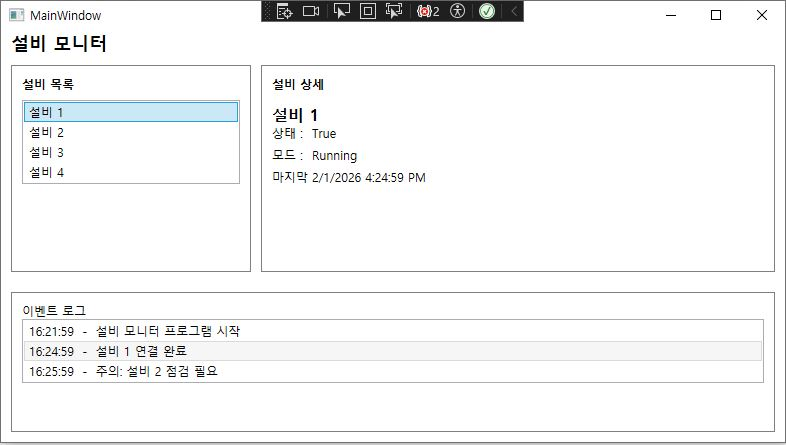
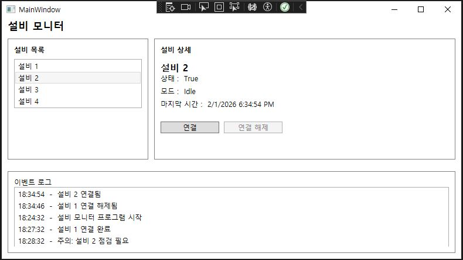

이사하느라 며칠동안 공부를 못했다. ~~그럼 다시!ㅎ~~

---
### Mini MES

**화면 구성, 기능**
- 좌측: 설비 목록
  설비(설비 1~4)를 리스트로 표시하고, 선택한 설비를 현재 대상으로 설정
- 우측: 설비 상세
  연결 상태(연결, 해제)
  가동 모드(가동, 대기)
  마지막 확인(예: 2분 전)
- 우측 하단: 제어 버튼
  선택된 설비에 대한 연결, 연결 해제 동작
- 하단: 이벤트 로그

**목표**
- **사용자 동작은 Command** <br>
    `연결`, `연결 해제` 같은 버튼 클릭을 `ICommand`를 통해 연결한다.  
- **데이터, 상태 변경은 Binding** <br>
    선택 설비, 연결 상태, 모드, 마지막 확인 시간 같은 값은 `Binding`으로 연결한다.  
    값이 바뀌면 `INotifyPropertyChanged`로 UI가 자동 갱신되도록 구성한다.
- **설비 목록, 이벤트 로그는 ObservableCollection** <br>
  `ObservableCollection<T>`로 **이벤트를 발생**시켜 UI를 자동으로 갱신되도록 구성한다.
### 폴더 구조(MVVM)
- `Models`
- `ViewModels`
- `Views`
---
### ViewModel
#### ViewModels/MainViewModel.cs
`INotifyPropertyChanged`를 사용하여 선택된 설비 보여주기
```csharp
internal class MainViewModel:INotifyPropertyChanged
{	
	public event PropertyChangedEventHandler? PropertyChanged;
	private Equipment? _selectedEquipment;
	public Equipment? SelectedEquipment
	{
		get => _selectedEquipment;
		set
		{
			if (_selectedEquipment == value) return;
			_selectedEquipment = value;
			OnPropertyChanged();
		}
	}
```
- 필드는 `_`언더바로 시작, 프로퍼티는 대문자로 시작(복합명사일때는 `PascalCase`)

```csharp
public MainViewModel() {
    Equipments.Add(new Equipment { ...

    LogItems.Add(...
    
	//Equipments.FirstOrDefault() == Equipments[0]
    SelectedEquipment = Equipments.FirstOrDefault(); 
}
```
- `FirstOrDefault`는 첫번째 요소를 가져오는 기능을 제공하는 **LINQ**메서드다.
- `Equipments[0]`와 같은 의미

### View
선택된 설비 Binding하기
#### Views/MainWindow.xaml
```csharp
<Border Grid.Column="0" BorderBrush="Gray" BorderThickness="1" Padding="10">
    <StackPanel>
    <TextBlock Text="설비 목록" FontWeight="DemiBold" Margin="0,0,0,8"/>
        <ListBox ItemsSource="{Binding Equipments}"
             DisplayMemberPath="Name"
             SelectedItem="{Binding SelectedEquipment}"
             Height="Auto"/>
    </StackPanel>
</Border>
```
- `ItemsSource`는 화면에 나열할 데이터 목록(컬렉션)을 지정한다.
- `SelectedItem`은 현재 선택된 항목(객체)을 나타낸다.

##### 설비 상세 Binding하기
```CSHARP
<Border Grid.Column="2" BorderBrush="Gray" BorderThickness="1" Padding="10">
    <StackPanel>
    <TextBlock Text="설비 상세" FontWeight="DemiBold" Margin="0,0,0,12"/>
        <TextBlock FontSize="16" FontWeight="SemiBold" Text="{Binding SelectedEquipment.Name}"/>
        <StackPanel Orientation="Horizontal" Margin="0,0,0,6">
            <TextBlock Text="상태 : " Width="40"/>
            <TextBlock Text="{Binding SelectedEquipment.IsConnected}"/>
        </StackPanel>
        <StackPanel Orientation="Horizontal" Margin="0,0,0,6">
            <TextBlock Text="모드 : " Width="40"/>
            <TextBlock Text="{Binding SelectedEquipment.Mode}"/>
        </StackPanel>
        <StackPanel Orientation="Horizontal" Margin="0,0,0,6">
            <TextBlock Text="마지막 확인 : " Width="40"/>
            <TextBlock Text="{Binding SelectedEquipment.LastSeen}"/>
        </StackPanel>
    </StackPanel>
</Border>
```
- 헷갈리는 부분 `Margin = 0,0,0,0` (좌, 상, 우, 하) 
- `Padding`도 마찬가지



### ViewModel
버튼 ICommand 구현
#### ViewModels/RelayCommand.cs
- `execute` 클릭했을 때 실행될 기능
- `canExecute`조건
- 이벤트 알림 `CanExecuteChanged`
```csharp
public class RelayCommand : ICommand
    {
        private readonly Action _execute;
        private readonly Func<bool>? _canExecute;

        public RelayCommand(Action execute, Func<bool>? canExecute = null)
        {
            _execute = execute;
            _canExecute = canExecute;
        }

        public bool CanExecute(object? parameter)
            => _canExecute == null || _canExecute();

        public void Execute(object? parameter)
            => _execute();

        public event EventHandler? CanExecuteChanged;
        public void RaiseCanExecuteChanged()
            => CanExecuteChanged?.Invoke(this, EventArgs.Empty);
    }
```

### MainViewModel
#### 프로퍼티 추가
```csharp
public RelayCommand ConnectCommand { get; }
public RelayCommand DisconnectCommand { get; }
```
#### Command 추가
```csharp
    ConnectCommand = new RelayCommand(
        execute: () =>
        {
            SelectedEquipment.IsConnected = true;
            SelectedEquipment.LastSeen = DateTime.Now;

            LogItems.Insert(0, new LogItem
            {
                Time = DateTime.Now,
                Message = $"{SelectedEquipment.Name} 연결됨"
            });

            OnPropertyChanged(nameof(SelectedEquipment));
        },
        canExecute: () => SelectedEquipment != null && !SelectedEquipment.IsConnected
        );

    DisconnectCommand = new RelayCommand(
        execute: () =>
        {
            SelectedEquipment.IsConnected = false;
            SelectedEquipment.LastSeen = DateTime.Now;
            LogItems.Insert(0, new LogItem
            {
                Time = DateTime.Now,
                Message = $"{SelectedEquipment.Name} 연결 해제됨"
            });
            OnPropertyChanged(nameof(SelectedEquipment));
        },
        canExecute: () => SelectedEquipment != null && SelectedEquipment.IsConnected
        );
}
```
- `execute` 클릭했을 때 실행될 기능
- `canExecute`조건
- - `Add()`는 맨 끝에 추가되기 때문에 `Insert(0, ...)`로 0번째 인덱스로 맨 앞으로 배치 
    → 최신 로그가 리스트 **맨 위**
- `OnPropertyChanged(nameof(SelectedEquipment))` == `OnPropertyChanged("SelectedEquipment")` 같은 의미
#### 선택된 설비가 바뀌면 버튼 활성화
```csharp
set
{
    if (_selectedEquipment == value) return;
    _selectedEquipment = value;
    OnPropertyChanged();

    ConnectCommand?.RaiseCanExecuteChanged();
    DisconnectCommand?.RaiseCanExecuteChanged();
}
```

### View
#### 버튼에 Binding 하기
```csharp
 <StackPanel Orientation="Horizontal" Margin="0,16,0,0">
     <Button Content="연결" Width="100" Margin="0,0,8,0" Command="{Binding ConnectCommand}"/>
     <Button Content="연결 해제" Width="100" Margin="0,0,8,0" Command="{Binding DisconnectCommand}"/>
 </StackPanel>
```



WPF, MVVM 기본 구조에서 이제 DevExpress로 컨트롤을 교체해보겠다.